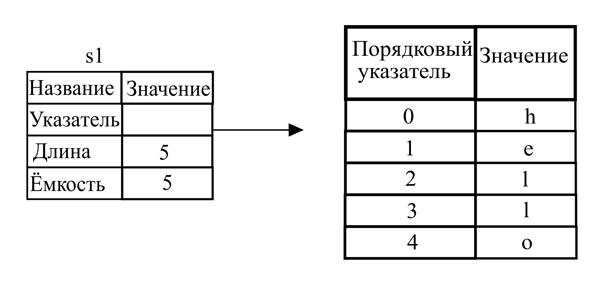
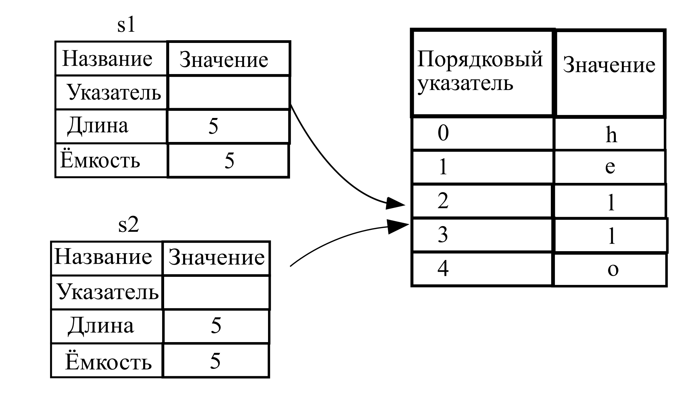
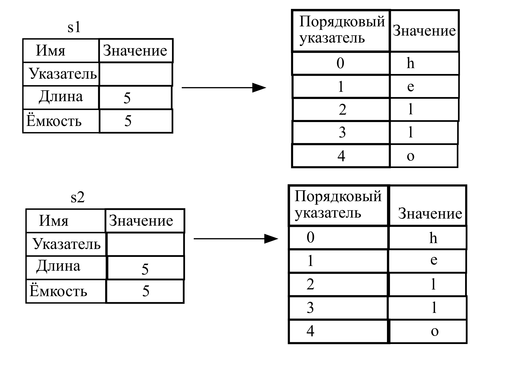
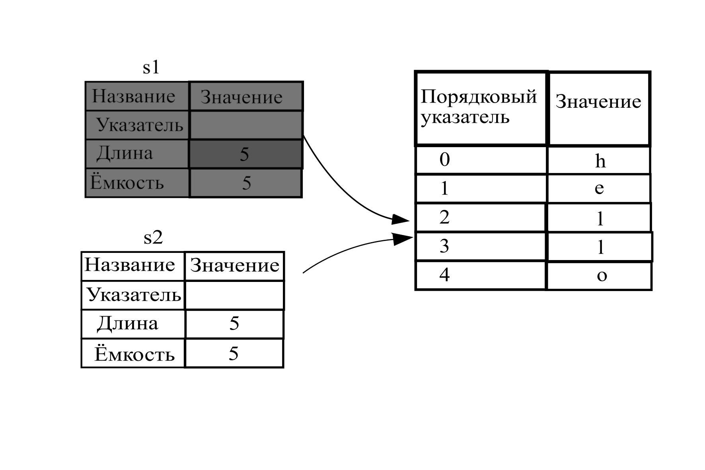

## Что же такое владение?

*Владение* является весьма важной концепцией Rust. Неудивительно, что она весьма сильно
повлияла на язык программирования в целом.

Существует множество решений по управлению памятью во время работы программы.
Это системы сборки мусора (куча), ручное управление выделенными ресурсами. Rust предлагает
своё решение: управление ресурсами осуществляется посредством набора правил владения,
которые компилятор проверяет во время создания программы (компиляции).

Так как эта концепция ещё нова для многих программистов, её осознание и эффективное
использование потребует определённых навыков. Наградой будет владение инструментом
для создания безопасных и эффективных программ. Думаю, что данная цель того стоит.

Понимание концепции владениия даст вам основу для понимания всех остальных особенностей
Rust. В этой главе вы будите изучать владение на примере работы со строковым типом
данных.


<!-- PROD: START BOX -->

> ### Стек и куча
>
> Во многих языках программирования вам обычно не нужно уделять много внимания организации
> работы с памятью. Для системного языка программирование эта тема весьма важна.
> Место хранения переменной (это стек или куча) очень важно. Это весьма сильно
> влияет на языковые конструкции и рекомендуемые шаблоны.
>
> Хотя и стек, и куча - это всё части доступной для программ области памяти, но их
> структура и способы взаимодействия с ними различны. Стек сохраняет значения в
> порядке получения и удаляет их в противоположном порядке (LIFO - *last in, first out*).
> Стек подобен стопке тарелок. Вы накладываете тарелки сверху и когда нужно берёте
> их сверху.

> Работа со стеком даёт большой выигрыш по времени, т.к. нет необходимости в системе
> поиска нужных данных, а также все сохраняемые там данные имеют известный размер.
>
> Для тех данных, размер которых неизвестен во время компиляции, используется другое
> место хранения - куча. В куче нет чёткой организации данных. Когда вы сохраняете
> данные в куче, вы запрашиваете произвольный размер памяти. Операционная система
> ищет необходимый блок и предоставляет ссылку на его начало. Этот процесс называется
> *выделение памяти в куче*. Или просто *выделение памяти*.
>
> Система выделения памяти работает медленнее стека, т.к. мы должны затратить время
> на поиск места в памяти.
>
> Когда код вызывает функцию, все локальные переменные сохраняются в стеке. 
> Когда функция прекращает работу, все её переменные удаляются из стека.
>
> Отслеживание того, какая часть кода какие данные использует из кучи, минимизирует 
> дублирование и позволяет удалять ненужное. Это приводит к эффективному использованию
> системных ресурсов. Когда вы разберётесь с концепцией владения вы не будете думать
> о стеке и куче, но всё же понимание как эти системы распределения памяти работают
> поможет более глубокому пониманию теоретического материала.
>

<!-- PROD: END BOX -->

### Правила владения

Прежде всего, давайте познакомимся с самими правилами. Пожалуйста, помните о них
во время практической работы с примерами программ:

> 1. Каждое значение имеет переменную, которая ей владеет, т.е. имеет *владельца*.
> 2. Одновременно, у значения может быть только один владелец.
> 3. Когда переменная выходит за область видимости, значение удаляется.

### Область видимости переменной

Для объяснения области видимости мы абстрагируемся от какого-либо контейнера.
Будем считать, что код находится в каком-то контейнере, например, внутри определения
функции `main`.

Рассмотрим область видимости переменной. Область видимости - это область, в которой
с переменной можно осуществлять какие-либо действия. Сначала объявим переменную:

```rust,ignore
let s = "hello";
```

Переменная `s` ссылается на строковый литерал. Значение данной переменной вписано
в код программы. Переменная считается действительной с момента её объявления до
конца текущей области видимости.

Два важных замечания:
1. Когда переменная `s` появляется в области видимости, она считается действительной.
2. Она остаётся действительной до момента выхода за границы этой области.

Отталкиваясь от понимания этих замечаний мы переходим к объяснению более сложной
концепции.

### Тип данных `String`

Для объяснения правил владения, рассмотрим более сложный тип данных. До сих пор
мы рассматривали типы данных, которые хранились в стеке. Теперь рассмотрим данные,
которые хранятся в куче, и рассмотрим, как Rust узнаёт, когда можно удалить данные.

Мы будем использовать тип данных `String` и рассмотрим ту часть описания данного
типа, которая связана с владением. Владение работает таким же образом и для других
типов данных. Более подробно мы познакомимся с типом данных `String` в главе 8.

Мы уже видели работу со строковыми литералами в предыдущих главах, где значение
строк было вписано в код программы. Строковые литералы удобны для использования,
но не могут решить всех вопросов при работе с этим типом данных. Важной особенностью
строковых литералов является их неизменяемость. Для работы с текстовыми данными,
когда их значение и размер заранее не известен (например, при вводе данных с клавиатуры),
используется тип данных `String`. Данные этого типа хранятся в куче. Размер
таких данных неизвестен в момент компиляции. Вы можете создать переменную данного
типа с помощью статической функции `from`:

```rust,ignore
let s = String::from("hello");
```

Двойное двоеточие (`::`) - это оператор, которые определяет пространство имён типа.
В данном случае пространство имён типа `String`. Более подробно мы обсудим синтаксис
методов в главе 5. Пространство имён обсудим в главе 7.

Такие строки *могут* быть изменены:

```rust
fn main() {
    let mut s = String::from("hello");

    s.push_str(", world!"); // push_str() appends a literal to a String

    println!("{}", s); // This will print `hello, world!`
}

```

В чём же отличия изменяемых строковых типов данных `String` и неизменяемых литеральных?
Отличия в способе работы с памятью.

### Память и способы её выделения

Тот факт, что значение литеральных типов известно в момент компиляции, делает работу
с ними таким эффективным. К сожалению, мы не можем заранее выделить часть памяти
для хранения данных неизвестного типа и размера.

Для хранения таких данных (таких как данные типа `String`) наиболее удобно использовать
кучу. Это значит, что:

1. Размер необходимой памяти запрашивается программой в момент её выполнения.
2. Необходим механизм возвращения неиспользуемой памяти обратно операционной системе.

Первый пункт этого списка решается с помощью метода типа `String::from`. Это довольно-таки
универсальное решение.

Но второй пункт довольно-таки специфичен для каждой системы (языка программирования,
технологии). Там где используется сборщик мусора, он отслеживает и очищает память, которая
больше не используется, и нам не нужно об этом думать. Там где нет сборщиков мусора
программист сам должен отслеживать использование ресурсов и явным образом их освобождать.
Исторически, корректное освобождение ресурсов - источник ошибок и одна из проблем
в программировании. Если данные не удаляются своевременно, это приводит к бесполезному
расходованию ресурсов. Если данные удаляются, а часть переменных программы ссылается
на них - это приводит к сбоям. Повторное возвращение данных операционной системе
также приводит к ошибкам. Мы должны один раз получить и один раз возвратить ресурс.

Rust предлагает решение этой проблемы - ресурсы памяти возвращаются автоматически,
когда переменная вышла за область видимости. Пример:

```rust
{
    let s = String::from("hello"); // s is valid from this point forward

    // do stuff with s
}                                  // this scope is now over, and s is no
                                   // longer valid
```

Это довольно-таки естественный способ освобождения неиспользованной памяти. Когда
переменная выходит за рамки области видимости, Rust вызывает специальную функцию
для освобождения памяти. Эта функция называется `drop`. Можно сказать, что это последний
оператор в любой области видимости.

> Обратите внимание: В C++, такой шаблон освобождения ресурсов называется
> *Получение ресурса есть инициализация* (*Resource Acquisition Is Initialization (RAII)*).
> Функция `drop` будет вам понятна, если у Вас уже есть опыт использования данного
> шаблона при программировании на C++.

Этот шаблон сильно влияет на стиль и способ создания программ на Rust. Поведение программы
может быть непредсказуемым, когда необходимо нескольким переменным использовать
данные из кучи. Рассмотрим эту ситуацию подробнее:

#### Способы взаимодействия переменных и данных: перемещение

Несколько переменных может взаимодействовать с одними и теми же данными различными
способами. Listing 4-2:

```rust
let x = 5;
let y = x;
```

<span class="caption">Listing 4-2: Присваивание целочисленного значения переменной
 `x` переменной `y`</span>

 Вы, конечно, можете догадаться, что же тут происходит. Переменной `x` присваивается
 значение `5`. Потом создаётся копия этого значения, которая присваивается переменной
 `y`. После выполнения этих строчек кода обе переменные будут иметь значение `5`.
 Эти переменные имеют простой тип данных и известны в момент компиляции значения.
 Вся данные хранятся в стеке.

Теперь рассмотрим этот же пример с другим типом данныx (`String`):

```rust
let s1 = String::from("hello");
let s2 = s1;
```

Хотя код внешне выглядит таким же, но алгоритм работы совсем иной.

Для более подробного объяснения давайте рассмотрим структуру `String` (рисунок 4-3).
`String` состоит из трёх частей: ссылки на память, которая содержит данные, длину
и ёмкость. Эта группа данных сохраняется в стеке. Справа память кучи, которая
содержит данные.



<span class="caption">Figure 4-3: Представление переменной `s1` в памяти, имеющей
 тип данных `String`, содержащей значение `"hello"`</span>

 Длина (в байтах) содержит величину данных, которая в данный момент используется.
 Ёмкость - это общее количество памяти (в байтах), которое переменная получила от
 операционной системы. Разница между длинной данных и ёмкостью, конечно имеет значение,
 но на объяснение взаимодействия переменной и памяти эта информация никак не повлияет.
 Пока проигнорируем эту разницу.

 При присваивании переменной `s1` переменной `s2` данные типа копируются в стеке,
 т.е. копируются данные о ссылке, длине и ёмкости. Представления данных в памяти
 выглядит следующим образом (Рисунок 4-4).

 

 <span class="caption">Рисунок  4-4: Представление в памяти переменной `s2`,
  которая содержит копию ссылки, длину и ёмкость переменной `s1`</span>

 Это представление отличается от того, если бы копировалось всё содержимое кучи.
 Если бы Rust позволял это делать, операция присваивания `s2 = s1` могла быть очень
 затратной (по скорости её выполнения), если бы ёмкость копируемых данных и их сложность
 была высокой.



<span class="caption">Рисунок 4-5: Другая возможность при копировании `s2 = s1`  -
копирование содержимого кучи</span>

Ранее, мы говорили, что когда переменная выходит за границы области видимости, Rust
автоматически вызывает метод `drop` и очищает память кучи для этой переменной. Рисунок
4-4 показывает, что имеется две ссылки на одни данные. Это является проблемой и источником
потенциальной ошибки, т.к. при выходе за границы области видимости переменных `s2` и `s1`,
нужно очистить одну и ту же область памяти. Это ошибка называется *двойная очистка*.
Такая двойная очистка может быть причиной повреждения данных в памяти, что в свою очередь
может привести к проблемам безопасности.

Для обеспечения безопасности памяти, существует решение. Вместо копирования выделенной
памяти, Rust считает переменную `s1` недействительной. Кроме того т.к. переменная не
является действительной, то она не должна ничего освобождать. Пожалуйста, проверьте,
что произойдёт, когда вы попытаетесь использовать переменную `s1` после создания
`s2`:

```rust,ignore,does_not_compile
fn main() {
    let s1 = String::from("hello");
    let s2 = s1;

    println!("{}, world!", s1);
    println!("{}, world!", s2);
}

```

В терминальной строке вы увидите подобное сообщение, информирующее о том, что переменную
`s1` уже нельзя использовать:

```text
error[E0382]: use of moved value: `s1`
 --> src/main.rs:4:27
  |
3 |     let s2 = s1;
  |         -- value moved here
4 |     println!("{}, world!", s1);
  |                            ^^ value used here after move
  |
  = note: move occurs because `s1` has type `std::string::String`,
which does not implement the `Copy` trait
```

Вы, наверное, уже слышали о разных вариациях копирования в других языках программирования:
поверхностное и глубокое. Концепция копирования в Rust может показаться похожей на 
поверхностое копирование ссылки, длины и ёмкости. Но у Rust есть существенное отличие - копируемая
переменная становится недействительной после операции копирования в другую переменную.
Эта операция называется перемещением. Так что можно сказать, что переменная `s1`
была перемещена в переменную `s2`. То, что действительно произошло показано на рисунке
4-6.



<span class="caption">Figure 4-6: Состояние памяти после перемещения переменной `s1`</span>

Это решает проблему множественного доступа к памяти в куче. Такой проблемы
просто нет. Только одна переменная действительна и имеет права на данные - это переменная
`s2`.

Также обратите внимание, что по-умолчанию Rust никогда не делает глубокого копирования данных.
Поэтому любое автоматическое копирование может быть недорогим с точки зрения производительности.

#### Способы взаимодействия переменныx и данных: клонирование

Если вы действительно хотите глубокого копирования данных в куче типа данных `String`,
вы можете использовать метод `clone`. Мы подробнее расскажем о синтаксисе этого
метода в главе 5.

Пример:

```rust
let s1 = String::from("hello");
let s2 = s1.clone();

println!("s1 = {}, s2 = {}", s1, s2);
```

Этот метод копирования замечательно работает, и это тот способ, который вы можете использовать,
чтобы добиться поведения описанного на рисунке 4-5 (где данные кучи были скопированы).

Когда в исходном коде программы вы встречаете использование метода `clone`, знайте,
что использование этого метода может быть затратным по производительности.

#### Стековые данные: Копирование

Это ещё одна особенность о которой мы ещё не говорили. Этот код использует целые
числа, часть которого была показа ранее в листинге 4-2. Этот код работает и не имеет
ошибок:

```rust
let x = 5;
let y = x;

println!("x = {}, y = {}", x, y);
```

Но этот код кажется противоречит тому, что мы только что изучили: мы не должны
вызывать `clone`, но `x` остаётся действительной переменнной и не перемещается в `y`

Причина в том, что такие типы, как целые числа, которые имеют известный размер во время
компиляции, хранятся полностью в стеке, поэтому копии фактических значений можно быстро создавать. 

В Rust есть специальная аннотация типаж `Copy`, благодаря которой любой тип может
быть сохранён в стеке (типажи будут подробно рассмотрены в главе 10). Если тип имеет 
типаж `Copy`, переменные, которые владели данными до текущей переменной, остаются доступными.
Rust имеет следующие ограничения: тип не может одновременно иметь типаж `Copy` и `Drop`.
Любая группа скалярных значений может быть `Copy`.
Список типов, которые имею типаж `Copy`:

* Все целочисленные типы, такие как `u32`.
* Логический тип данных `bool`, значения которых `true` и `false`.
* Все числа с плавающей запятой такие как `f64`.
* Кортежи, но только если они содержат типы, которые также `Copy`. `(i32, i32)`
`Copy`, но `(i32, String)` нет.

### Владение и функции

Семантически передача значений в функцию схожа с присвоением значения переменной.
Переменная, которая передаётся в функцию будет перемещаться или копироваться. Пример
кода 4-7 демонстрирует как переменные входят и выходят из области видимости:

<span class="filename">Filename: src/main.rs</span>

```rust
fn main() {
    let s = String::from("hello");  // переменная s появляется в области видимости.

    takes_ownership(s);             // s перемещается в функцию...
    //println!("{}", s);    // ... соответственно переменная s становится недействительной в текущей области видимости.
    let x = 5;                      // переменная x появляется в области видимости.

    makes_copy(x);                  // кажется, что x будет перемещена в функцию,
    println!("{}", x);              // но i32 имеет типаж Copy, значит x не перемещается и остается действительным,
                                    // в функцию передается копия значения 

} // Здесь, x выходит из области видимости, затем s. Но так как s была перемещена и стала недействительной,
// то функция drop выполнится успешно.

fn takes_ownership(some_string: String) { // some_string появляется в области видимости.
    println!("{}", some_string);
} // Здесь, some_string выходит из области видимости и вызывается `drop`. Память, 
// выделенная под строку, освобождается.

fn makes_copy(some_integer: i32) { // some_integer появляется в области видимости.
    println!("{}", some_integer);
} // Здесь, some_integer выходит из области видимости.
```

<span class="caption">Listing 4-7: Демонстрация изменения владения посредством передачи
функции переменной. Демонстрация выхода переменной за пределы области видимости и
освобождения ресурсов</span>

Если вы попытаетесь использовать переменную после вызова метода `takes_ownership`,
компилятор Rust сообщит вам об ошибке. При повторном использовании переменной
`x` всё будет в порядке.

### Возвращения данных из области видимости

Возвращение значений также может переместить владение.
Пример 4-7:

<span class="filename">Filename: src/main.rs</span>

```rust
fn main() {
    let s1 = gives_ownership();         // gives_ownership перемещает возвращаемое
    println!("{}",s1);                  // значение в переменную s1

    let s2 = String::from("hello");     // s2 появляется в области видимости

    let s3 = takes_and_gives_back(s2);  // s2 пермещается в
    //println!("{}",s2);                // takes_and_gives_back, которая в свою очередь
    println!("{}",s3);                  // перемещает возвращаемое значение в s3
} // Здесь, s3 выходит из области видимости и очищается. s2 выходит из области видимости, 
// но она была перемещена (стала недействительной). s1 выходит из области видимости и очищается.

fn gives_ownership() -> String {             // gives_ownership переместит возвращаемое
                                             // значение в функцию, которая
                                             // вызвала gives_ownership

    let some_string = String::from("hello"); // some_string появляется в области видимости
    println!("{}",some_string);
    some_string                              // выражение some_string возвращает значение,
                                             // которое будет перемещено в вызвавшую gives_ownership
                                             // функцию
}

// takes_and_gives_back принимает и возвращает String
fn takes_and_gives_back(a_string: String) -> String { // a_string появляется в области видимости

    a_string  // a_string возвращает значение, которое будет перемещено в вызвавшую функцию
}
```


Изменение владения ведётся по описанным ранее законам. Оно перемещается при изменении
владельца данных.

На практике очень неудобно всегда отслеживать владение данными.

При передаче данных в функцию и из функции, для упрощения работы, удобно использовать
кортежи:

<span class="filename">Filename: src/main.rs</span>

```rust
fn main() {
    let s1 = String::from("hello");

    let (s2, len) = calculate_length(s1);

    println!("The length of '{}' is {}.", s2, len);
}

fn calculate_length(s: String) -> (String, usize) {
    let length = s.len(); // len() возвращает длину String.

    (s, length)
}
```

Было бы конечно сложно писать программы на Rust если бы были только такие возможности
доступные программисту при работе с владением памятью. К счастью, существуют
*ссылки*, которые упрощают эту работу.
