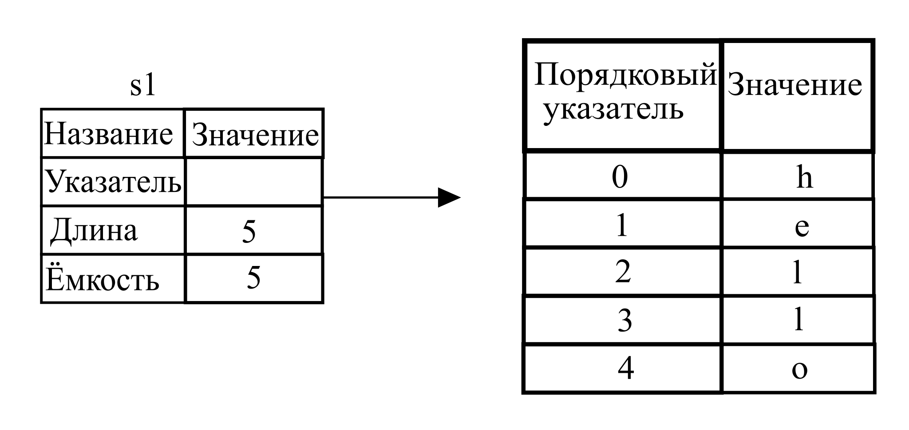
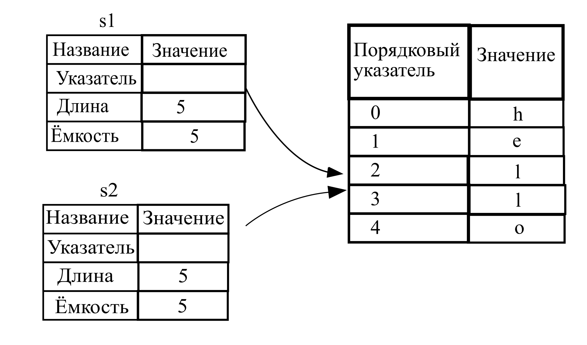
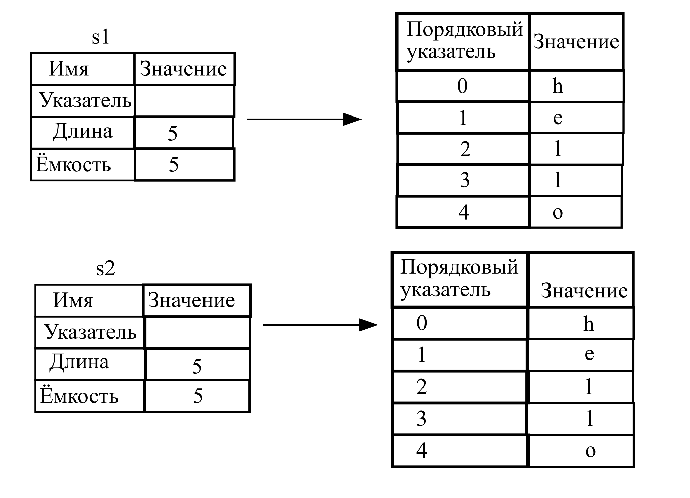
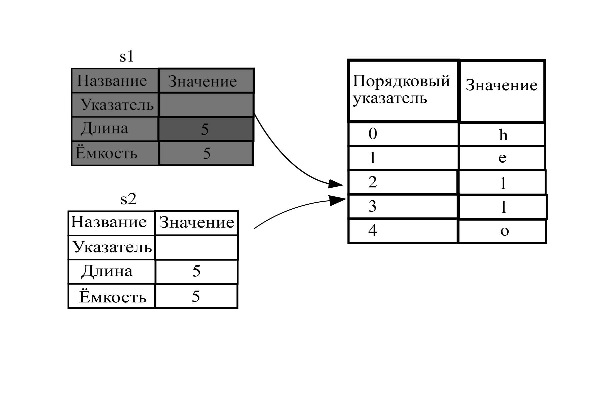
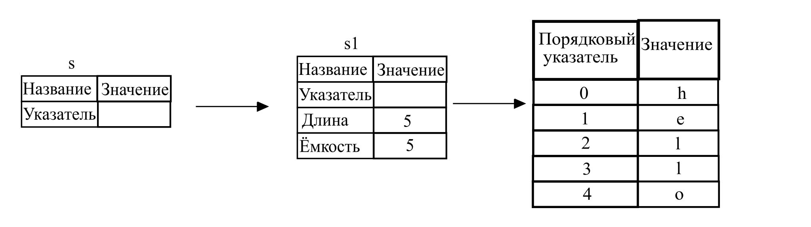

## Что такое владение?

_Владение_ — это набор правил, которые определяют, как программа на Rust
управляет памятью. Все программы во время выполнения должны управлять тем, как
они используют память компьютера. В одних языках есть сборка мусора, которая
регулярно ищет память, больше не используемую программой; в других языках
программист должен явно выделять и освобождать память. Rust использует третий
подход: память управляется через систему владения с набором правил, которые
проверяет компилятор. Если нарушено любое из этих правил, программа не
скомпилируется. Ни одна из возможностей владения не замедляет вашу программу
во время выполнения.

Поскольку владение — новая концепция для многих программистов, к нему нужно
немного привыкнуть. Хорошая новость в том, что чем больше опыта вы получаете
с Rust и правилами системы владения, тем естественнее вам будет писать
безопасный и эффективный код. Продолжайте практиковаться!

Когда вы поймёте владение, у вас будет прочная основа для понимания
возможностей, которые делают Rust уникальным. В этой главе вы изучите владение
на примерах, сосредоточенных на очень распространённой структуре данных:
строках.

> ### Стек и куча
>
> Во многих языках программирования не нужно часто думать о стеке и куче. Но
> в системном языке программирования, таком как Rust, то, находится ли значение
> в стеке или в куче, влияет на поведение языка и на то, почему вам приходится
> принимать определённые решения. Позже в этой главе части владения будут
> описываться через связь со стеком и кучей, поэтому сначала дадим краткое
> объяснение.
>
> И стек, и куча — это части памяти, доступные вашему коду во время выполнения,
> но устроены они по-разному. Стек хранит значения в порядке их поступления,
> а удаляет их в обратном порядке. Это называется _последним пришёл — первым
> вышел (last in, first out, LIFO)_. Представьте стопку тарелок: когда вы
> добавляете тарелки, вы кладёте их наверх, а когда нужна тарелка, берёте одну
> сверху. Добавлять или убирать тарелки из середины или снизу было бы не так
> удобно! Добавление данных называется _помещением в стек_, а удаление данных —
> _извлечением из стека_. Все данные, хранящиеся в стеке, должны иметь
> известный фиксированный размер. Данные, размер которых во время компиляции
> неизвестен или может изменяться, должны храниться в куче.
>
> Куча менее организована: когда вы помещаете данные в кучу, вы запрашиваете
> определённый объём пространства. Аллокатор памяти находит в куче достаточно
> большое свободное место, помечает его как используемое и возвращает
> _указатель_ — адрес этого места. Этот процесс называется _выделением памяти
> в куче_ и иногда сокращается просто до _выделения памяти_ (помещение значений
> в стек выделением памяти не считается). Поскольку указатель на кучу имеет
> известный фиксированный размер, вы можете хранить указатель в стеке, но,
> когда вам нужны сами данные, нужно перейти по указателю. Представьте, что вас
> рассаживают в ресторане. Когда вы входите, вы называете количество людей
> в вашей группе, и администратор находит свободный стол, подходящий всем,
> и провожает вас туда. Если кто-то из вашей группы придёт позже, он сможет
> спросить, куда вас посадили, чтобы найти вас.
>
> Помещение в стек быстрее, чем выделение памяти в куче, потому что аллокатору
> не нужно искать место для хранения новых данных; это место всегда находится
> на вершине стека. Для сравнения, выделение пространства в куче требует больше
> работы, потому что аллокатор должен сначала найти достаточно большое место
> для данных, а затем выполнить служебный учёт, чтобы подготовиться к следующему
> выделению.
>
> Доступ к данным в куче обычно медленнее, чем доступ к данным в стеке, потому
> что нужно перейти по указателю. Современные процессоры работают быстрее, если
> им приходится меньше прыгать по памяти. Продолжая аналогию, представьте
> официанта в ресторане, который принимает заказы за многими столами.
> Эффективнее всего получить все заказы за одним столом, прежде чем переходить
> к следующему. Взять заказ со стола A, затем со стола B, затем снова со стола
> A, а потом снова со стола B было бы гораздо медленнее. По той же причине
> процессор обычно лучше выполняет свою работу, если обрабатывает данные,
> расположенные близко к другим данным (как в стеке), а не дальше от них
> (как может быть в куче).
>
> Когда ваш код вызывает функцию, значения, переданные в функцию (включая,
> возможно, указатели на данные в куче), и локальные переменные функции
> помещаются в стек. Когда функция завершается, эти значения извлекаются
> из стека.
>
> Отслеживание того, какие части кода используют какие данные в куче,
> минимизация количества дублирующихся данных в куче и очистка неиспользуемых
> данных в куче, чтобы у вас не закончилось место, — всё это проблемы, которые
> решает владение. Когда вы поймёте владение, вам не нужно будет часто думать
> о стеке и куче. Но знание того, что главная цель владения — управление
> данными в куче, помогает объяснить, почему оно работает именно так.

### Правила владения

Сначала посмотрим на правила владения. Держите эти правила в уме, пока мы
будем разбирать примеры, которые их иллюстрируют:

- Каждое значение в Rust имеет _владельца_.
- В каждый момент времени может быть только один владелец.
- Когда владелец выходит из области видимости, значение будет удалено.

### Область видимости переменной

Теперь, когда базовый синтаксис Rust уже позади, мы не будем включать во все
примеры код `fn main() {`, поэтому, если вы повторяете за нами, вручную
помещайте следующие примеры внутрь функции `main`. Благодаря этому примеры
будут немного короче, и мы сможем сосредоточиться на реальных деталях, а не
на шаблонном коде.

В качестве первого примера владения рассмотрим область видимости некоторых
переменных. _Область видимости_ — это диапазон в программе, в котором элемент
является действительным. Возьмём следующую переменную:

```rust
let s = "hello";
```

Переменная `s` ссылается на строковый литерал, значение которого жёстко задано
в тексте нашей программы. Переменная действительна с момента объявления до
конца текущей области видимости. Листинг 4-1 показывает программу
с комментариями, отмечающими, где переменная `s` была бы действительной.

<Listing number="4-1" caption="Переменная и область видимости, в которой она действительна">

```rust
{{#rustdoc_include ../listings/ch04-understanding-ownership/listing-04-01/src/main.rs:here}}
```

</Listing>

Другими словами, здесь есть два важных момента времени:

- Когда `s` _входит_ в область видимости, она становится действительной.
- Она остаётся действительной, пока не _выходит_ из области видимости.

На этом этапе связь между областями видимости и тем, когда переменные
действительны, похожа на другие языки программирования. Теперь мы расширим это
понимание, введя тип `String`.

### Тип `String`

Чтобы проиллюстрировать правила владения, нам нужен тип данных сложнее тех,
которые мы рассматривали в разделе [«Типы данных»][data-types]<!-- ignore -->
Главы 3. Рассмотренные ранее типы имеют известный размер, могут храниться
в стеке и извлекаться из стека, когда их область видимости завершается, а также
могут быстро и тривиально копироваться для создания нового независимого
экземпляра, если другой части кода нужно использовать то же значение в другой
области видимости. Но мы хотим посмотреть на данные, которые хранятся в куче,
и разобраться, как Rust узнаёт, когда нужно очистить эти данные; тип `String`
для этого отлично подходит.

Мы сосредоточимся на тех частях `String`, которые связаны с владением. Эти
аспекты также применимы к другим сложным типам данных, независимо от того,
предоставлены они стандартной библиотекой или созданы вами. Аспекты `String`,
не связанные с владением, мы обсудим в [Главе 8][ch8]<!-- ignore -->.

Мы уже видели строковые литералы, где строковое значение жёстко задано в нашей
программе. Строковые литералы удобны, но подходят не для каждой ситуации, когда
мы хотим использовать текст. Одна причина в том, что они неизменяемы. Другая —
не каждое строковое значение может быть известно во время написания кода:
например, что если мы хотим принять пользовательский ввод и сохранить его?
Для таких ситуаций в Rust есть тип `String`. Этот тип управляет данными,
выделенными в куче, и поэтому способен хранить объём текста, неизвестный нам
во время компиляции. Вы можете создать `String` из строкового литерала
с помощью функции `from`, например так:

```rust
let s = String::from("hello");
```

Оператор двойного двоеточия `::` позволяет поместить именно эту функцию `from`
в пространство имён типа `String`, а не использовать какое-нибудь имя вроде
`string_from`. Мы подробнее обсудим этот синтаксис в разделе
[«Методы»][methods]<!-- ignore --> Главы 5, а также когда будем говорить
о пространствах имён с модулями в разделе [«Пути для обращения к элементу
в дереве модулей»][paths-module-tree]<!-- ignore --> Главы 7.

Такой вид строки _можно_ изменять:

```rust
{{#rustdoc_include ../listings/ch04-understanding-ownership/no-listing-01-can-mutate-string/src/main.rs:here}}
```

Так в чём же разница? Почему `String` можно изменять, а литералы нельзя?
Разница в том, как эти два типа работают с памятью.

### Память и выделение памяти

В случае строкового литерала мы знаем содержимое во время компиляции, поэтому
текст жёстко встраивается прямо в итоговый исполняемый файл. Именно поэтому
строковые литералы быстры и эффективны. Но эти свойства возникают только
благодаря неизменяемости строкового литерала. К сожалению, мы не можем поместить
в бинарный файл блок памяти для каждого фрагмента текста, размер которого
неизвестен во время компиляции и может изменяться во время выполнения
программы.

В случае типа `String`, чтобы поддерживать изменяемый, растущий фрагмент
текста, нам нужно выделить в куче объём памяти, неизвестный во время
компиляции, для хранения содержимого. Это означает:

- Память должна быть запрошена у аллокатора памяти во время выполнения.
- Нам нужен способ вернуть эту память аллокатору, когда мы закончим работать
  с нашим `String`.

Первую часть выполняем мы: когда мы вызываем `String::from`, его реализация
запрашивает необходимую память. Это почти универсально для языков
программирования.

Однако вторая часть отличается. В языках со _сборщиком мусора (garbage
collector, GC)_ сборщик мусора отслеживает и очищает память, которая больше не
используется, и нам не нужно об этом думать. В большинстве языков без GC наша
ответственность — определить, когда память больше не используется, и вызвать
код для её явного освобождения, так же как мы вызывали код для её запроса.
Исторически сделать это правильно было трудной задачей программирования. Если
мы забудем, мы будем расходовать память впустую. Если сделаем это слишком
рано, у нас появится недействительная переменная. Если сделаем это дважды, это
тоже ошибка. Нужно сопоставить ровно один `allocate` с ровно одним `free`.

Rust идёт другим путём: память автоматически возвращается, когда переменная,
которая ею владеет, выходит из области видимости. Вот версия нашего примера
с областью видимости из листинга 4-1, использующая `String` вместо строкового
литерала:

```rust
{{#rustdoc_include ../listings/ch04-understanding-ownership/no-listing-02-string-scope/src/main.rs:here}}
```

Есть естественный момент, когда мы можем вернуть аллокатору память, которая
нужна нашему `String`: когда `s` выходит из области видимости. Когда переменная
выходит из области видимости, Rust вызывает для нас специальную функцию. Эта
функция называется `drop`, и именно туда автор `String` может поместить код для
возврата памяти. Rust автоматически вызывает `drop` при закрывающей фигурной
скобке.

> Примечание: в C++ этот паттерн освобождения ресурсов в конце времени жизни
> элемента иногда называется _получение ресурса является инициализацией (Resource
> Acquisition Is Initialization, RAII)_. Функция `drop` в Rust будет вам
> знакома, если вы использовали паттерны RAII.

Этот паттерн глубоко влияет на то, как пишется код Rust. Сейчас это может
казаться простым, но в более сложных ситуациях поведение кода может быть
неожиданным, когда мы хотим, чтобы несколько переменных использовали данные,
выделенные нами в куче. Давайте теперь рассмотрим несколько таких ситуаций.

<!-- Old headings. Do not remove or links may break. -->

<a id="ways-variables-and-data-interact-move"></a>

#### Взаимодействие переменных и данных при перемещении

В Rust несколько переменных могут по-разному взаимодействовать с одними и теми
же данными. Листинг 4-2 показывает пример с целым числом.

<Listing number="4-2" caption="Присваивание целочисленного значения переменной `x` переменной `y`">

```rust
{{#rustdoc_include ../listings/ch04-understanding-ownership/listing-04-02/src/main.rs:here}}
```

</Listing>

Вероятно, мы можем догадаться, что здесь происходит: «Свяжи значение `5` с `x`;
затем сделай копию значения в `x` и свяжи её с `y`». Теперь у нас есть две
переменные, `x` и `y`, и обе равны `5`. Именно это и происходит, потому что
целые числа — простые значения с известным фиксированным размером, и оба эти
значения `5` помещаются в стек.

Теперь посмотрим на версию со `String`:

```rust
{{#rustdoc_include ../listings/ch04-understanding-ownership/no-listing-03-string-move/src/main.rs:here}}
```

Это выглядит очень похоже, поэтому можно предположить, что работать это будет
так же: то есть вторая строка создаст копию значения из `s1` и свяжет её
с `s2`. Но происходит не совсем это.

Посмотрите на рисунок 4-1, чтобы увидеть, что происходит со `String` внутри.
`String` состоит из трёх частей, показанных слева: указателя на память, где
хранится содержимое строки, длины и ёмкости. Эта группа данных хранится
в стеке. Справа находится память в куче, которая хранит содержимое.



<span class="caption">Рисунок 4-1: Представление в памяти значения `String`,
содержащего `"hello"` и связанного с `s1`</span>

Длина — это объём памяти в байтах, который в данный момент использует
содержимое `String`. Ёмкость — это общий объём памяти в байтах, который
`String` получил от аллокатора. Разница между длиной и ёмкостью важна, но не
в этом контексте, поэтому сейчас можно не обращать внимания на ёмкость.

Когда мы присваиваем `s1` переменной `s2`, данные `String` копируются: мы
копируем указатель, длину и ёмкость, находящиеся в стеке. Мы не копируем данные
в куче, на которые указывает указатель. Другими словами, представление данных
в памяти выглядит как на рисунке 4-2.



<span class="caption">Рисунок 4-2: Представление в памяти переменной `s2`,
которая содержит копию указателя, длины и ёмкости `s1`</span>

Представление _не_ выглядит как на рисунке 4-3, где показано, как выглядела бы
память, если бы Rust также копировал данные в куче. Если бы Rust так делал,
операция `s2 = s1` могла бы быть очень дорогой с точки зрения
производительности во время выполнения, если бы данные в куче были большими.



<span class="caption">Рисунок 4-3: Другой возможный вариант того, что могла бы
делать операция `s2 = s1`, если бы Rust также копировал данные в куче</span>

Ранее мы говорили, что, когда переменная выходит из области видимости, Rust
автоматически вызывает функцию `drop` и очищает память в куче для этой
переменной. Но рисунок 4-2 показывает, что оба указателя данных указывают на
одно и то же место. Это проблема: когда `s2` и `s1` выйдут из области
видимости, они обе попытаются освободить одну и ту же память. Это известно как
ошибка _двойного освобождения_ и является одной из ошибок безопасности памяти,
о которых мы упоминали ранее. Двойное освобождение памяти может привести
к повреждению памяти, что потенциально может привести к уязвимостям
безопасности.

Чтобы обеспечить безопасность памяти, после строки `let s2 = s1;` Rust считает
`s1` недействительной. Поэтому Rust не нужно ничего освобождать, когда `s1`
выходит из области видимости. Посмотрите, что произойдёт, если попытаться
использовать `s1` после создания `s2`; это не сработает:

```rust,ignore,does_not_compile
{{#rustdoc_include ../listings/ch04-understanding-ownership/no-listing-04-cant-use-after-move/src/main.rs:here}}
```

Вы получите такую ошибку, потому что Rust не позволяет использовать
недействительное значение:

```console
{{#include ../listings/ch04-understanding-ownership/no-listing-04-cant-use-after-move/output.txt}}
```

Если при работе с другими языками вы слышали термины _поверхностное
копирование_ и _глубокое копирование_, то копирование указателя, длины
и ёмкости без копирования самих данных, вероятно, похоже на поверхностное
копирование. Но поскольку Rust также делает первую переменную недействительной,
это называется не поверхностным копированием, а _перемещением_. В этом примере
мы сказали бы, что `s1` была _перемещена_ в `s2`. Таким образом, на самом деле
происходит то, что показано на рисунке 4-4.



<span class="caption">Рисунок 4-4: Представление в памяти после того, как `s1`
стала недействительной</span>

Это решает нашу проблему! Поскольку действительна только `s2`, когда она
выйдет из области видимости, только она освободит память, и на этом всё.

Кроме того, из этого следует одно проектное решение: Rust никогда
автоматически не создаёт «глубокие» копии ваших данных. Поэтому любое
_автоматическое_ копирование можно считать недорогим с точки зрения
производительности во время выполнения.

#### Область видимости и присваивание

Обратное тоже верно для связи между областью видимости, владением
и освобождением памяти через функцию `drop`. Когда вы присваиваете существующей
переменной совершенно новое значение, Rust вызовет `drop` и немедленно
освободит память исходного значения. Рассмотрим, например, этот код:

```rust
{{#rustdoc_include ../listings/ch04-understanding-ownership/no-listing-04b-replacement-drop/src/main.rs:here}}
```

Сначала мы объявляем переменную `s` и связываем её со `String` со значением
`"hello"`. Затем сразу создаём новый `String` со значением `"ahoy"`
и присваиваем его `s`. В этот момент на исходное значение в куче уже вообще
ничто не ссылается. Рисунок 4-5 показывает, как теперь выглядят данные в стеке
и куче:



<span class="caption">Рисунок 4-5: Представление в памяти после того, как
исходное значение было полностью заменено</span>

Таким образом, исходная строка немедленно выходит из области видимости. Rust
выполнит для неё функцию `drop`, и её память будет сразу освобождена. Когда
в конце мы выведем значение, это будет `"ahoy, world!"`.

<!-- Old headings. Do not remove or links may break. -->

<a id="ways-variables-and-data-interact-clone"></a>

#### Взаимодействие переменных и данных при клонировании

Если мы _действительно_ хотим глубоко скопировать данные `String` в куче, а не
только данные в стеке, можно использовать распространённый метод `clone`. Мы
обсудим синтаксис методов в Главе 5, но, поскольку методы — распространённая
возможность во многих языках программирования, вы, вероятно, уже видели их
раньше.

Вот пример использования метода `clone`:

```rust
{{#rustdoc_include ../listings/ch04-understanding-ownership/no-listing-05-clone/src/main.rs:here}}
```

Это работает как надо и явно создаёт поведение, показанное на рисунке 4-3, где
данные в куче _действительно_ копируются.

Когда вы видите вызов `clone`, вы знаете, что выполняется некоторый произвольный
код, и этот код может быть дорогим. Это визуальный индикатор того, что
происходит что-то отличное от обычного.

#### Данные только в стеке: Copy

Есть ещё одна тонкость, о которой мы пока не говорили. Этот код с целыми
числами, часть которого была показана в листинге 4-2, работает и является
допустимым:

```rust
{{#rustdoc_include ../listings/ch04-understanding-ownership/no-listing-06-copy/src/main.rs:here}}
```

Но этот код, кажется, противоречит тому, что мы только что узнали: у нас нет
вызова `clone`, но `x` всё ещё действительна и не была перемещена в `y`.

Причина в том, что типы вроде целых чисел, имеющие известный во время
компиляции размер, полностью хранятся в стеке, поэтому копии самих значений
создаются быстро. Это означает, что нет причины запрещать `x` оставаться
действительной после создания переменной `y`. Другими словами, здесь нет
разницы между глубоким и поверхностным копированием, поэтому вызов `clone` не
сделал бы ничего отличного от обычного поверхностного копирования, и мы можем
его не использовать.

В Rust есть специальная аннотация, называемая трейтом `Copy`, которую можно
использовать для типов, хранящихся в стеке, как целые числа (подробнее
о трейтах мы поговорим в [Главе 10][traits]<!-- ignore -->). Если тип
реализует трейт `Copy`, переменные, использующие его, не перемещаются,
а тривиально копируются, поэтому остаются действительными после присваивания
другой переменной.

Rust не позволит нам пометить тип как `Copy`, если сам тип или любая его часть
реализует трейт `Drop`. Если типу нужно выполнить что-то особое, когда значение
выходит из области видимости, а мы добавим к этому типу аннотацию `Copy`, то
получим ошибку времени компиляции. Чтобы узнать, как добавить аннотацию `Copy`
к своему типу для реализации трейта, смотрите [«Автоматически выводимые
трейты»][derivable-traits]<!-- ignore --> в Приложении C.

Итак, какие типы реализуют трейт `Copy`? Чтобы убедиться, можно проверить
документацию конкретного типа, но общее правило такое: любая группа простых
скалярных значений может реализовывать `Copy`, а ничто, что требует выделения
памяти или является какой-либо формой ресурса, не может реализовывать `Copy`.
Вот некоторые типы, реализующие `Copy`:

- Все целочисленные типы, например `u32`.
- Логический тип `bool` со значениями `true` и `false`.
- Все типы с плавающей точкой, например `f64`.
- Символьный тип `char`.
- Кортежи, если они содержат только типы, которые тоже реализуют `Copy`.
  Например, `(i32, i32)` реализует `Copy`, а `(i32, String)` — нет.

### Владение и функции

Механика передачи значения в функцию похожа на присваивание значения
переменной. Передача переменной в функцию приводит к перемещению или
копированию, как и присваивание. В листинге 4-3 приведён пример с аннотациями,
показывающими, где переменные входят в область видимости и выходят из неё.

<Listing number="4-3" file-name="src/main.rs" caption="Функции с аннотациями владения и области видимости">

```rust
{{#rustdoc_include ../listings/ch04-understanding-ownership/listing-04-03/src/main.rs}}
```

</Listing>

Если бы мы попытались использовать `s` после вызова `takes_ownership`, Rust
выдал бы ошибку времени компиляции. Эти статические проверки защищают нас от
ошибок. Попробуйте добавить в `main` код, использующий `s` и `x`, чтобы
увидеть, где их можно использовать, а где правила владения не позволят это
сделать.

### Возвращаемые значения и область видимости

Возврат значений также может передавать владение. Листинг 4-4 показывает
пример функции, которая возвращает некоторое значение, с аннотациями,
похожими на аннотации из листинга 4-3.

<Listing number="4-4" file-name="src/main.rs" caption="Передача владения возвращаемыми значениями">

```rust
{{#rustdoc_include ../listings/ch04-understanding-ownership/listing-04-04/src/main.rs}}
```

</Listing>

Владение переменной каждый раз следует одному и тому же паттерну: присваивание
значения другой переменной перемещает его. Когда переменная, включающая данные
в куче, выходит из области видимости, значение будет очищено функцией `drop`,
если владение данными не было перемещено в другую переменную.

Хотя это работает, принимать владение и затем возвращать владение из каждой
функции немного утомительно. Что, если мы хотим позволить функции использовать
значение, но не забирать владение? Довольно неудобно, что всё, что мы передаём
в функцию, также нужно передавать обратно, если мы хотим использовать это
снова, в дополнение к любым данным, полученным из тела функции, которые мы
тоже можем захотеть вернуть.

Rust позволяет возвращать несколько значений с помощью кортежа, как показано
в листинге 4-5.

<Listing number="4-5" file-name="src/main.rs" caption="Возврат владения параметрами">

```rust
{{#rustdoc_include ../listings/ch04-understanding-ownership/listing-04-05/src/main.rs}}
```

</Listing>

Но это слишком много формальностей и работы для концепции, которая должна быть
обычной. К счастью для нас, в Rust есть возможность использовать значение без
передачи владения: ссылки.

[data-types]: ch03-02-data-types.html#data-types
[ch8]: ch08-02-strings.html
[traits]: ch10-02-traits.html
[derivable-traits]: appendix-03-derivable-traits.html
[methods]: ch05-03-method-syntax.html#methods
[paths-module-tree]: ch07-03-paths-for-referring-to-an-item-in-the-module-tree.html
