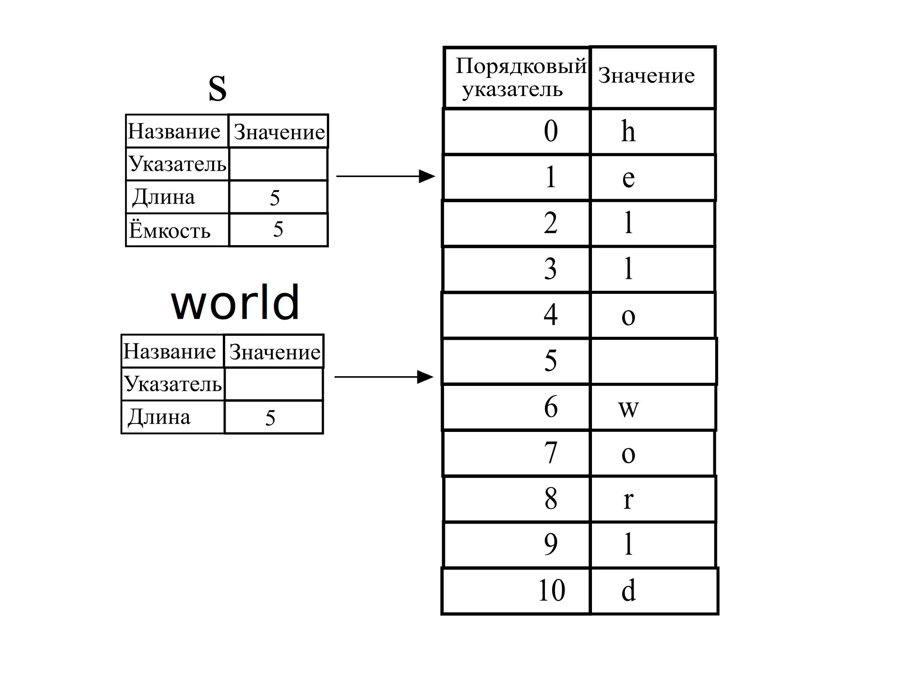

## Ссылки и заимствование

Проблема кода с кортежем в листинге 4-5 состоит в том, что нам приходится
возвращать `String` вызывающей функции, чтобы мы всё ещё могли использовать
`String` после вызова `calculate_length`, потому что значение `String` было
перемещено в `calculate_length`. Вместо этого мы можем предоставить ссылку
на значение `String`. Ссылка похожа на указатель тем, что это адрес, по
которому можно перейти для доступа к данным, хранящимся по этому адресу; этими
данными владеет какая-то другая переменная. В отличие от указателя, ссылка
гарантированно указывает на действительное значение определённого типа
на протяжении всей жизни этой ссылки.

Вот как можно определить и использовать функцию `calculate_length`, которая
принимает ссылку на объект в качестве параметра вместо того, чтобы забирать
владение значением:

<Listing file-name="src/main.rs">

```rust
{{#rustdoc_include ../listings/ch04-understanding-ownership/no-listing-07-reference/src/main.rs:all}}
```

</Listing>

Во-первых, обратите внимание, что весь код с кортежем в объявлении переменной
и возвращаемом значении функции исчез. Во-вторых, заметьте, что мы передаём
`&s1` в `calculate_length`, а в её определении принимаем `&String`, а не
`String`. Эти амперсанды обозначают ссылки и позволяют ссылаться на некоторое
значение, не забирая владение им. Рисунок 4-6 иллюстрирует эту концепцию.



<span class="caption">Рисунок 4-6: Схема, на которой `&String` `s` указывает
на `String` `s1`</span>

> Примечание: операция, противоположная созданию ссылки с помощью `&`, —
> _разыменование_, которое выполняется оператором разыменования `*`. Мы увидим
> несколько способов использования оператора разыменования в Главе 8
> и подробно обсудим разыменование в Главе 15.

Рассмотрим этот вызов функции подробнее:

```rust
{{#rustdoc_include ../listings/ch04-understanding-ownership/no-listing-07-reference/src/main.rs:here}}
```

Синтаксис `&s1` позволяет создать ссылку, которая _ссылается_ на значение `s1`,
но не владеет им. Поскольку ссылка им не владеет, значение, на которое она
указывает, не будет удалено, когда ссылка перестанет использоваться.

Точно так же сигнатура функции использует `&`, чтобы указать, что тип параметра
`s` — ссылка. Добавим несколько поясняющих аннотаций:

```rust
{{#rustdoc_include ../listings/ch04-understanding-ownership/no-listing-08-reference-with-annotations/src/main.rs:here}}
```

Область видимости, в которой переменная `s` действительна, такая же, как
у любого параметра функции, но значение, на которое указывает ссылка, не
удаляется, когда `s` перестаёт использоваться, потому что `s` не владеет им.
Когда функции принимают ссылки как параметры вместо самих значений, нам не
нужно возвращать значения, чтобы вернуть владение, потому что владения у нас
никогда не было.

Действие создания ссылки мы называем _заимствованием_. Как и в реальной жизни,
если человек владеет чем-то, вы можете это у него одолжить. Когда вы закончите,
нужно вернуть это обратно. Вы этим не владеете.

Что же произойдёт, если мы попытаемся изменить то, что заимствуем? Попробуйте
код из листинга 4-6. Спойлер: это не работает!

<Listing number="4-6" file-name="src/main.rs" caption="Попытка изменить заимствованное значение">

```rust,ignore,does_not_compile
{{#rustdoc_include ../listings/ch04-understanding-ownership/listing-04-06/src/main.rs}}
```

</Listing>

Вот ошибка:

```console
{{#include ../listings/ch04-understanding-ownership/listing-04-06/output.txt}}
```

Как переменные по умолчанию неизменяемы, так и ссылки по умолчанию
неизменяемы. Нам не разрешено изменять то, на что у нас есть ссылка.

### Изменяемые ссылки

Мы можем исправить код из листинга 4-6, чтобы разрешить изменять
заимствованное значение, внеся всего несколько небольших правок и используя
_изменяемую ссылку_:

<Listing file-name="src/main.rs">

```rust
{{#rustdoc_include ../listings/ch04-understanding-ownership/no-listing-09-fixes-listing-04-06/src/main.rs}}
```

</Listing>

Сначала мы меняем `s`, делая её `mut`. Затем создаём изменяемую ссылку
с помощью `&mut s` в месте вызова функции `change` и обновляем сигнатуру
функции, чтобы она принимала изменяемую ссылку `some_string: &mut String`.
Это очень ясно показывает, что функция `change` будет изменять значение,
которое она заимствует.

У изменяемых ссылок есть одно большое ограничение: если у вас есть изменяемая
ссылка на значение, у вас не может быть других ссылок на это значение. Этот
код, пытающийся создать две изменяемые ссылки на `s`, завершится ошибкой:

<Listing file-name="src/main.rs">

```rust,ignore,does_not_compile
{{#rustdoc_include ../listings/ch04-understanding-ownership/no-listing-10-multiple-mut-not-allowed/src/main.rs:here}}
```

</Listing>

Вот ошибка:

```console
{{#include ../listings/ch04-understanding-ownership/no-listing-10-multiple-mut-not-allowed/output.txt}}
```

Эта ошибка говорит, что такой код недопустим, потому что мы не можем
заимствовать `s` как изменяемую более одного раза одновременно. Первое
изменяемое заимствование находится в `r1` и должно длиться до его использования
в `println!`, но между созданием этой изменяемой ссылки и её использованием мы
попытались создать другую изменяемую ссылку в `r2`, которая заимствует те же
данные, что и `r1`.

Ограничение, запрещающее несколько изменяемых ссылок на одни и те же данные
одновременно, допускает изменение, но в очень контролируемом виде. Новым
разработчикам Rust с этим бывает сложно, потому что большинство языков
позволяют изменять данные когда угодно. Польза этого ограничения в том, что
Rust может предотвращать гонки данных во время компиляции. _Гонка данных_
похожа на состояние гонки и возникает, когда происходят три следующих события:

- Два или более указателя одновременно обращаются к одним и тем же данным.
- Хотя бы один из указателей используется для записи в данные.
- Не используется механизм для синхронизации доступа к данным.

Гонки данных вызывают неопределённое поведение, и их бывает трудно
диагностировать и исправлять, когда вы пытаетесь отследить их во время
выполнения; Rust предотвращает эту проблему, отказываясь компилировать код
с гонками данных!

Как всегда, мы можем использовать фигурные скобки, чтобы создать новую область
видимости, разрешающую несколько изменяемых ссылок, но только не
_одновременных_:

```rust
{{#rustdoc_include ../listings/ch04-understanding-ownership/no-listing-11-muts-in-separate-scopes/src/main.rs:here}}
```

Rust применяет похожее правило для сочетания изменяемых и неизменяемых ссылок.
Этот код приводит к ошибке:

```rust,ignore,does_not_compile
{{#rustdoc_include ../listings/ch04-understanding-ownership/no-listing-12-immutable-and-mutable-not-allowed/src/main.rs:here}}
```

Вот ошибка:

```console
{{#include ../listings/ch04-understanding-ownership/no-listing-12-immutable-and-mutable-not-allowed/output.txt}}
```

Уф! Мы _также_ не можем иметь изменяемую ссылку, пока у нас есть неизменяемая
ссылка на то же значение.

Пользователи неизменяемой ссылки не ожидают, что значение внезапно изменится
прямо у них под рукой! Однако несколько неизменяемых ссылок разрешены, потому
что никто, кто только читает данные, не может повлиять на чтение данных кем-то
ещё.

Обратите внимание, что область действия ссылки начинается там, где она введена,
и продолжается до последнего использования этой ссылки. Например, этот код
скомпилируется, потому что последнее использование неизменяемых ссылок
находится в `println!`, до введения изменяемой ссылки:

```rust
{{#rustdoc_include ../listings/ch04-understanding-ownership/no-listing-13-reference-scope-ends/src/main.rs:here}}
```

Области действия неизменяемых ссылок `r1` и `r2` заканчиваются после
`println!`, где они используются в последний раз, то есть до создания
изменяемой ссылки `r3`. Эти области не пересекаются, поэтому такой код
разрешён: компилятор может определить, что ссылка больше не используется
в точке до конца области видимости.

Хотя ошибки заимствования иногда могут раздражать, помните: это компилятор
Rust заранее указывает на потенциальную ошибку (во время компиляции, а не во
время выполнения) и точно показывает, где находится проблема. Тогда вам не
придётся выяснять, почему ваши данные оказались не такими, какими вы их
ожидали.

### Висячие ссылки

В языках с указателями легко ошибочно создать _висячий указатель_ — указатель,
который ссылается на место в памяти, уже, возможно, переданное кому-то ещё, —
освободив часть памяти, но сохранив указатель на эту память. В Rust, напротив,
компилятор гарантирует, что ссылки никогда не будут висячими ссылками: если
у вас есть ссылка на какие-то данные, компилятор убедится, что данные не выйдут
из области видимости раньше, чем ссылка на эти данные.

Попробуем создать висячую ссылку, чтобы увидеть, как Rust предотвращает это
ошибкой времени компиляции:

<Listing file-name="src/main.rs">

```rust,ignore,does_not_compile
{{#rustdoc_include ../listings/ch04-understanding-ownership/no-listing-14-dangling-reference/src/main.rs}}
```

</Listing>

Вот ошибка:

```console
{{#include ../listings/ch04-understanding-ownership/no-listing-14-dangling-reference/output.txt}}
```

Это сообщение об ошибке относится к возможности, которую мы ещё не
рассматривали: временам жизни. Мы подробно обсудим времена жизни в Главе 10.
Но если не обращать внимания на части о временах жизни, сообщение всё же
содержит ключ к пониманию того, почему этот код является проблемой:

```text
this function's return type contains a borrowed value, but there is no value
for it to be borrowed from
```

Давайте подробнее рассмотрим, что именно происходит на каждом этапе нашего
кода `dangle`:

<Listing file-name="src/main.rs">

```rust,ignore,does_not_compile
{{#rustdoc_include ../listings/ch04-understanding-ownership/no-listing-15-dangling-reference-annotated/src/main.rs:here}}
```

</Listing>

Поскольку `s` создаётся внутри `dangle`, после завершения кода `dangle` память,
связанная с `s`, будет освобождена. Но мы попытались вернуть ссылку на неё.
Это означает, что такая ссылка указывала бы на недействительный `String`. Это
плохо! Rust не позволит нам сделать это.

Решение здесь — вернуть `String` напрямую:

```rust
{{#rustdoc_include ../listings/ch04-understanding-ownership/no-listing-16-no-dangle/src/main.rs:here}}
```

Это работает без проблем. Владение перемещается из функции наружу, и ничего
не освобождается.

### Правила ссылок

Подведём итог тому, что мы обсудили о ссылках:

- В любой момент времени у вас может быть _либо_ одна изменяемая ссылка,
  _либо_ любое количество неизменяемых ссылок.
- Ссылки всегда должны быть действительными.

Далее мы рассмотрим другой вид ссылок: срезы.
