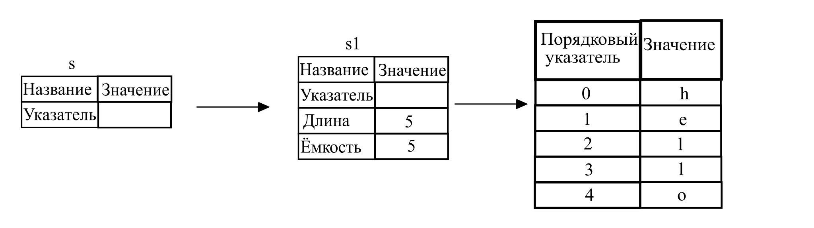

## Ссылочные переменные и заимствование

Необходимость использования кортежа в листинге 4-5, обусловлена необходимостью возврата переменной типа `String` в вызывающую функцию для дальнейшего использования `String` после вызова `calculate_length`, потому что `String` была перемещена в метод `calculate_length`.

Пример того, как вы бы определили и использовали функцию `calculate_length`, которая имеет ссылку на объект параметр вместо того, чтобы забирать во владение это значение :

<span class="filename">Файл: src/main.rs</span>

```rust
{{#rustdoc_include ../listings/ch04-understanding-ownership/no-listing-07-reference/src/main.rs:all}}
```

Сначала, обратите внимание, что код с кортежем в объявлении переменной и возвращаемом значении исчез. Второе, заметьте, что мы передаём `&s1` в функцию  `calculate_length` и в её объявлении мы используем  `&String` вместо `String`.

Данные амперсанды являются *ссылками* и позволяют ссылаться на некоторые значения не забирая их во владение. Картинка 4-5 показывает диаграмму.

 

<span class="caption">Картинка 4-5: Диаграмма для <code>&String s</code> указывающей на <code>String s1</code></span>

> Заметьте: Операцией обратной созданию ссылки используя `&` является операция *разыменования*, которая выполняется с помощью оператора разыменования `*`. Вы увидите использование этого оператора в главе 8 и мы обсудим детали ещё в главе 15.

Давайте подробнее рассмотрим механизм вызова функции:

```rust
{{#rustdoc_include ../listings/ch04-understanding-ownership/no-listing-07-reference/src/main.rs:here}}
```

Синтаксическая конструкция `&s1` позволяет создать  ссылку, которая *ссылается* на значение переменной `s1`, но не владеет ей. Т.к. нет передачи владения, то значение на которое она указывает не будет удалено, когда ссылка выйдет из области видимости.

Сигнатура функции использует `&` для индикации того, что типа параметра `s` является ссылкой. Добавим объясняющие комментарии:

```rust
{{#rustdoc_include ../listings/ch04-understanding-ownership/no-listing-08-reference-with-annotations/src/main.rs:here}}
```

Область видимости, в которой переменная `s` действительна, является такой же как у любого другого параметра функции, но мы не освобождаем значение на которое указывает ссылка, когда эта переменная уходит из области видимости, так как нет владения. Когда функции имеют параметры ссылки вместо значений, то не нужно возвращать значения, чтобы вернуть владение обратно, по причине полного отсутствия такого владения.

Наличие ссылок в качестве параметров функций называется  *заимствованием* (borrowing). Как и в реальной жизни, если человек владеет чем-то, вы можете позаимствовать это у него. Когда вы закончили, вы вернули это обратно.

А что произойдёт, если попытаться изменить то, что было позаимствовано? Попробуйте код листинга 4-6 Предупреждение - этот код не работает!

<span class="filename">Файл: src/main.rs</span>

```rust,ignore,does_not_compile
{{#rustdoc_include ../listings/ch04-understanding-ownership/listing-04-06/src/main.rs}}
```

<span class="caption">Listing 4-6: Попытка модификации заимствованной переменной</span>

Вот ошибка:

```console
{{#include ../listings/ch04-understanding-ownership/listing-04-06/output.txt}}
```

Как и переменные являются не изменяемыми по умолчанию, ссылочные переменные тоже являются неизменяемыми. Т.е. нельзя изменять данные по ссылке.

### Изменяемые ссылочные переменные

Можно исправить ошибку в коде листинга 4-6, для этого необходимо сделать небольшие изменения в коде:

<span class="filename">Файл: src/main.rs</span>

```rust
{{#rustdoc_include ../listings/ch04-understanding-ownership/no-listing-09-fixes-listing-04-06/src/main.rs}}
```

Первое, мы должны поменять `s` добавив `mut`. Затем нужно создать изменяемую ссылку с помощью `&mut s` и принять изменяемую ссылку с помощью `some_string: &mut String`.

Изменяемая ссылочная переменная имеет одно большое ограничение: можно иметь только одну изменяемую ссылочную переменную на часть данных в определённой области видимости. Такой код не будет скомпилирован:

<span class="filename">Файл: src/main.rs</span>

```rust,ignore,does_not_compile
{{#rustdoc_include ../listings/ch04-understanding-ownership/no-listing-10-multiple-mut-not-allowed/src/main.rs:here}}
```

Описание ошибки:

```console
{{#include ../listings/ch04-understanding-ownership/no-listing-10-multiple-mut-not-allowed/output.txt}}
```

Это ограничение позволяет изменять данные, но в очень контролируемой манере. Это то с чем новички сражаются, потому что большинство языков позволяет изменения, когда бы вы ни захотели, но так сделано для минимизации ошибок.

Польза от этого ограничения в том, что Rust может предотвратить возникновение эффекта гонок данных во время компиляции. Эффект *гонок данных* (data race) является похожим на состояние гонки и возникает, когда происходят три следующих поведения:

- Два или больше указателей используют те же данные в одно и тоже время.
- Минимум один указатель используется для записи данных.
- Отсутствуют механизмы для синхронизации доступа к данным.

Ситуация гонок данных приводит к неопределённому поведению (undefined behavior - UB), которая является трудно диагностируемой и трудно исправляемой проблемой при попытке отследить её во время выполнения; Rust предотвращает возникновение этой проблемы, потому что он даже не скомпилирует код с гонками данных!

Создание вложенных областей видимости с помощью фигурных скобок разрешается для создания множества изменяемых ссылок, но только не *одновременных*:

```rust
{{#rustdoc_include ../listings/ch04-understanding-ownership/no-listing-11-muts-in-separate-scopes/src/main.rs:here}}
```

Подобное правило существует и для комбинации изменяемых и неизменяемых ссылочных переменных. Пример кода с ошибкой:

```rust,ignore,does_not_compile
{{#rustdoc_include ../listings/ch04-understanding-ownership/no-listing-12-immutable-and-mutable-not-allowed/src/main.rs:here}}
```

Ошибка:

```console
{{#include ../listings/ch04-understanding-ownership/no-listing-12-immutable-and-mutable-not-allowed/output.txt}}
```

Вот так! Мы *также* не можем иметь изменяемую ссылочную переменную, пока существует неизменяемая ссылочная переменная. Пользователи неизменяемой ссылки не ожидают внезапного изменения значения на которые она указывает! Тем не менее, наличие множества неизменяемых переменных допускается, т.к. ни один из читающих данные не может изменить данные, которые все остальные также читают .

Заметим, что область видимости ссылочной переменной начинается от места, где она создана и продолжается до места где она последний раз использована. Например, данный код будет скомпилирован, потому что последнее использование неизменяемой ссылки происходит перед тем, как появляется изменяемая ссылка:

```rust,edition2018
{{#rustdoc_include ../listings/ch04-understanding-ownership/no-listing-13-reference-scope-ends/src/main.rs:here}}
```

Области видимости неизменяемых ссылочных переменных `r1` и `r2` заканчиваются после  `println!`, там где их последний раз использовали, что происходит перед созданием изменяемой ссылочной переменной `r3`. Данные области не пересекаются, так что этот код разрешён.

Не смотря на то, что ошибки заимствования могут иногда вызывать разочарование, помните, что компилятор Rust указывает про  потенциальную проблему на ранних этапах (во время компиляции, а не во время выполнения) и показывает точно, где находится проблема. Так что вам не нужно отслеживать, почему ваши данные не соответствуют вашим ожиданиям.

### Недействительные ссылки

В языках с указателями весьма легко ошибочно создать недействительную, висячую *(dangling)* ссылку. Ссылку указывающую на участок памяти, который мог быть передан кому-то другому, путём освобождения некоторой памяти при сохранении указателя на эту память. Rust компилятор гарантирует защиту, что ссылки никогда не будут недействительными: если у вас есть ссылка, то компилятор гарантирует что данные не выйдут из области видимости прежде, чем из области видимости исчезнет ссылка.

Попытаемся смоделировать подобную, висячую ссылку, которую компилятор предотвратит:

<span class="filename">Файл: src/main.rs</span>

```rust,ignore,does_not_compile
{{#rustdoc_include ../listings/ch04-understanding-ownership/no-listing-14-dangling-reference/src/main.rs}}
```

Здесь ошибка:

```console
{{#include ../listings/ch04-understanding-ownership/no-listing-14-dangling-reference/output.txt}}
```

Эта ошибка сообщает об ещё не освещённой нами возможности языка Rust: временам жизни переменных. Мы расскажем подробнее об этой возможности в главе 10. Но если вы проигнорируете раздел о времени жизни, сообщение содержит ключ к тому, почему этот код является проблемным:

```text
this function's return type contains a borrowed value, but there is no value
for it to be borrowed from.
```

Давайте пристальней рассмотрим, что же происходит на каждой стадии работы кода, который создаёт `недействительную` (dangle) ссылку:

<span class="filename">Файл: src/main.rs</span>

```rust,ignore,does_not_compile
{{#rustdoc_include ../listings/ch04-understanding-ownership/no-listing-15-dangling-reference-annotated/src/main.rs:here}}
```

По причине того, что переменная `s` создана внутри функции `dangle`, то при завершении `dangle` содержимое памяти для `s` будет удалено из памяти. Но мы пытаемся вернуть ссылку на эту память. Это означает, что данная ссылка могла бы указывать на недействительную `String`. Это плохо! Rust не позволит нам этого сделать.

Решением является вернуть непосредственно `String`:

```rust
{{#rustdoc_include ../listings/ch04-understanding-ownership/no-listing-16-no-dangle/src/main.rs:here}}
```

Это решение работает без проблем. Владение перемещено наружу и ничего не удаляется  из памяти.

### Правила работы с ссылками

Давайте повторим  все, что обсудили про ссылки:

- В один момент времени, может существовать *либо* одна изменяемая ссылочная переменная, *либо* любое количество неизменяемых ссылочных переменных.
- Все ссылки должны быть действительными.

В следующей главе мы рассмотрим другой тип ссылочных переменных - срезы.
