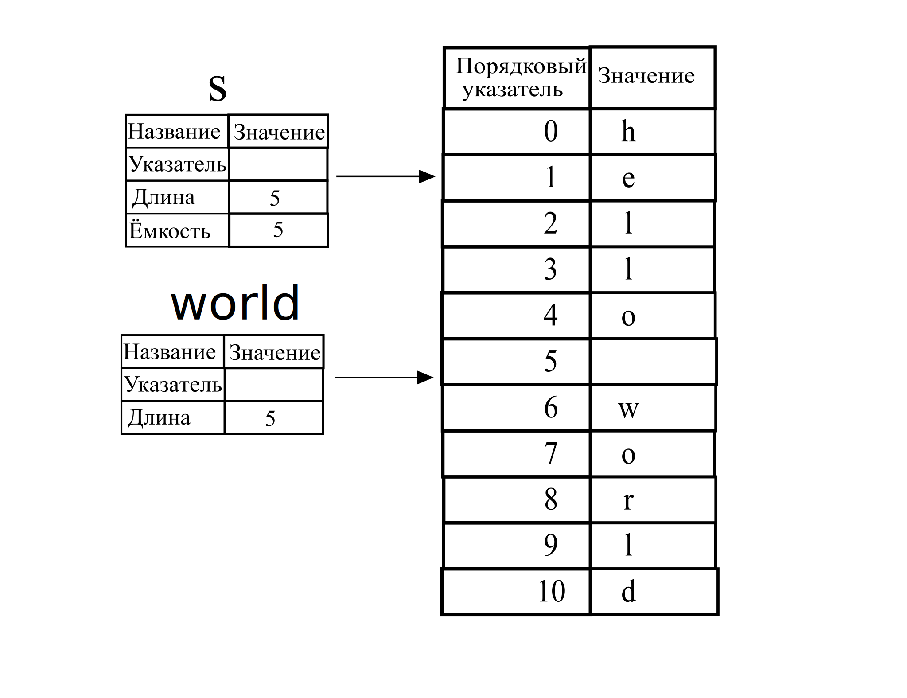

## Тип срезы

*Срезы* позволяют ссылаться на непрерывную последовательность элементов в коллекции, а не на всю коллекцию. Срез является своего рода ссылкой, поэтому он не имеет права владения.

Вот небольшая проблема программирования: напишите функцию, которая принимает строку слов, разделённых пробелами, и возвращает первое слово, которое она находит в этой строке. Если функция не находит пробела в строке, вся строка должна состоять из одного слова, поэтому должна быть возвращена вся строка.

Давайте рассмотрим, как бы мы написали сигнатуру этой функции без использования срезов, чтобы понять проблему, которую решат срезы:

```rust,ignore
fn first_word(s: &String) -> ?
```

Функция `first_word` имеет `&String` в качестве параметра. Мы не хотим владения, так что всё в порядке. Но что мы должны вернуть? На самом деле у нас нет способа говорить о *части* строки. Однако мы могли бы вернуть индекс конца слова, обозначенного пробелом. Давайте попробуем, как показано в Листинге 4-7.

<span class="filename">Файл: src/main.rs</span>

```rust
{{#rustdoc_include ../listings/ch04-understanding-ownership/listing-04-07/src/main.rs:here}}
```

<span class="caption">Листинг 4-7. Функция <code>first_word</code>, возвращающая значение индекса байта в параметр <code>String</code></span>

Поскольку нам нужно просмотреть `String` поэлементно и проверить, является ли значение пробелом, мы преобразуем нашу `String` в массив байтов с помощью метода `as_bytes`.

```rust,ignore
{{#rustdoc_include ../listings/ch04-understanding-ownership/listing-04-07/src/main.rs:as_bytes}}
```

Далее, мы создаём <em>итератор</em> по массиву байт используя метод `iter`:

```rust,ignore
{{#rustdoc_include ../listings/ch04-understanding-ownership/listing-04-07/src/main.rs:iter}}
```

Мы обсудим итераторы более подробно в [Главе 13]<!-- ignore -->. На данный момент знайте, что `iter` — это метод, который возвращает каждый элемент в коллекции, а `enumerate` оборачивает результат `iter` и вместо этого возвращает каждый элемент как часть кортежа. Первый элемент кортежа, возвращаемый из `enumerate`, является индексом, а второй элемент — ссылкой на элемент. Это немного удобнее, чем вычислять индекс самостоятельно.

Поскольку метод `enumerate` возвращает кортеж, мы можем использовать шаблоны для деструктурирования этого кортежа. Мы подробнее обсудим шаблоны в [Главе 6.]<!-- ignore -->. В цикле `for` мы указываем шаблон, имеющий `i` для индекса в кортеже и `&item` для одного байта в кортеже. Поскольку мы получаем ссылку на элемент из `.iter().enumerate()`, мы используем `&` в шаблоне.

Внутри цикла `for` мы ищем байт, представляющий пробел, используя синтаксис байтового литерала. Если мы находим пробел, мы возвращаем позицию. В противном случае мы возвращаем длину строки с помощью `s.len()`.

```rust,ignore
{{#rustdoc_include ../listings/ch04-understanding-ownership/listing-04-07/src/main.rs:inside_for}}
```

Теперь у нас есть способ узнать индекс байта указывающего на конец первого слова в строке, но есть проблема. Мы возвращаем сам `usize`, но это число имеет значение только в контексте `&String`. Другими словами, поскольку это значение отдельное от `String`, то нет гарантии, что оно все ещё будет действительным в будущем. Рассмотрим программу из листинга 4-8, которая использует функцию `first_word` листинга 4-7.

<span class="filename">Файл: src/main.rs</span>

```rust
{{#rustdoc_include ../listings/ch04-understanding-ownership/listing-04-08/src/main.rs:here}}
```

<span class="caption">Листинг 4-8. Сохранение результата вызова функции <code>first_word</code> и последующего изменения содержимого <code>String</code></span>

Данная программа компилируется без ошибок и будет успешно работать, даже после того как мы воспользуемся переменной `word` после вызова `s.clear()`. Так как значение `word` совсем не связано с состоянием переменной `s`, то `word` сохраняет своё значение `5` без изменений. Мы бы могли воспользоваться значением `5` чтобы получить первое слово из переменной `s`, но это приведёт к ошибке, потому что содержимое `s` изменилось после того как мы сохранили `5` в переменной `word` (стало пустой строкой в вызове `s.clear()`).

Необходимость беспокоиться о том, что индекс в переменной `word` не синхронизируется с данными в переменной  `s` является утомительной и подверженной ошибкам! Управление этими индексами становится ещё более хрупким, если мы напишем функцию `second_word`. Её сигнатура могла бы выглядеть так:

```rust,ignore
fn second_word(s: &String) -> (usize, usize) {
```

Теперь мы отслеживаем начальный *и* конечный индекс, и у нас есть ещё больше значений, которые были рассчитаны на основе данных в определённом состоянии, но вообще не привязаны к этому состоянию. У нас есть три несвязанные переменные, которые необходимо синхронизировать.

К счастью в Rust есть решение данной проблемы: строковые срезы.

### Строковые срезы

Строковый срез - это ссылка на часть строки `String` и он выглядит следующим образом:

```rust
{{#rustdoc_include ../listings/ch04-understanding-ownership/no-listing-17-slice/src/main.rs:here}}
```

Вместо ссылки на всю `String` `hello` является ссылкой на часть `String`, указанную в дополнительном куске кода `[0..5]`. Мы создаём срезы, используя диапазон в квадратных скобках, указав `[starting_index..ending_index]`, где `starting_index` — это первая позиция, а`ending_index` конечный_индекс — это на единицу больше, чем последняя позиция в срезе. Внутри структура данных среза хранит начальную позицию и длину среза, что соответствует `ending_index` минус `starting_index`. Итак, в случае `let world = &s[6..11];`, `world` будет срезом, содержащим указатель на байт с индексом 6 `s` со значением длины `5`.

Рисунок 4-6 отображает это на диаграмме.

 

<span class="caption">Рисунок 4-6: Строковый срез ссылается на часть <code>String</code></span>

С синтаксисом Rust `..`, если вы хотите начать с индекса 0, вы можете отбросить значение перед двумя точками. Другими словами, они равны:

```rust
let s = String::from("hello");

let slice = &s[0..2];
let slice = &s[..2];
```

Таким же образом, если ваш срез включает последний байт `String`, вы можете отбросить конечный номер. Это означает, что они равны:

```rust
let s = String::from("hello");

let len = s.len();

let slice = &s[3..len];
let slice = &s[3..];
```

Вы также можете отбросить оба значения, чтобы получить часть всей строки. Итак, они равны:

```rust
let s = String::from("hello");

let len = s.len();

let slice = &s[0..len];
let slice = &s[..];
```

>  Примечание. Индексы диапазона срезов строк должны располагаться на допустимых границах символов UTF-8. Если вы попытаетесь создать фрагмент строки нарушая границы символа в котором больше одного байта, ваша программа завершится с ошибкой. В целях введения срезов строк мы предполагаем, что в этом разделе используется только ASCII; более подробное обсуждение обработки UTF-8 находится в разделе [«Сохранение закодированного текста UTF-8 со строками»].<!-- ignore --> раздел главы 8.
>

Давайте используем полученную информацию и перепишем метод `first_word` так, чтобы он возвращал срез. Для обозначения типа "срез строки" существует запись `&str`:

<span class="filename">Файл: src/main.rs</span>

```rust
{{#rustdoc_include ../listings/ch04-understanding-ownership/no-listing-18-first-word-slice/src/main.rs:here}}
```

Мы получаем индекс конца слова так же, как в листинге 4.7, ища первое вхождение пробела. Когда мы находим пробел, мы возвращаем фрагмент строки, используя начало строки и индекс пробела в качестве начального и конечного индексов.

Теперь, когда мы вызываем `first_word`, мы возвращаем одно значение, привязанное к базовым данным. Значение состоит из ссылки на начальную точку среза и количества элементов в срезе.

Аналогичным образом можно переписать и второй метод `second_word`:

```rust,ignore
fn second_word(s: &String) -> &str {
```

Теперь у нас есть простой API, который гораздо сложнее испортить, потому что компилятор гарантирует, что ссылки в `String` останутся действительными. Помните ошибку в программе в листинге 4-8, когда мы получили индекс до конца первого слова, но затем очистили строку, так что наш индекс стал недействительным? Этот код был логически неправильным, но не показывал немедленных ошибок. Проблемы проявятся позже, если мы попытаемся использовать индекс первого слова с пустой строкой. Срезы делают эту ошибку невозможной и сообщают нам о проблеме с нашим кодом гораздо раньше. Так, использование версии метода `first_word` со срезом вернёт ошибку компиляции:

<span class="filename">Файл: src/main.rs</span>

```rust,ignore,does_not_compile
{{#rustdoc_include ../listings/ch04-understanding-ownership/no-listing-19-slice-error/src/main.rs:here}}
```

Ошибка компиляции:

```console
{{#include ../listings/ch04-understanding-ownership/no-listing-19-slice-error/output.txt}}
```

Напомним из правил заимствования, что если у нас есть неизменяемая ссылка на что-то, мы не можем также взять изменяемую ссылку. Поскольку для `clear` необходимо обрезать `String`, необходимо получить изменяемую ссылку. `println!` после вызова `clear` использует ссылку в `word`, поэтому неизменяемая ссылка в этот момент всё ещё должна быть активной. Rust запрещает одновременное существование изменяемой ссылки в формате `clear` и неизменяемой ссылки в `word`, и компиляция завершается ошибкой. Rust не только упростил использование нашего API, но и устранил целый класс ошибок во время компиляции!

<!-- Old heading. Do not remove or links may break. -->

<a id="string-literals-are-slices"></a>

#### Строковые литералы - это срезы

Напомним, что мы говорили о строковых литералах, хранящихся внутри бинарного файла. Теперь, когда мы знаем чем являются срезы, мы правильно понимаем что такое строковые литералы:

```rust
let s = "Hello, world!";
```

Тип `s` здесь `&str`: это срез, указывающий на эту конкретную точку двоичного файла. Вот почему строковые литералы неизменяемы; `&str` — неизменяемая ссылка.

#### Строковые срезы как параметры

Знание того, что вы можете брать срезы литералов и `String` значений, приводит нас к ещё одному улучшению `first_word`, и это его сигнатура:

```rust,ignore
fn first_word(s: &String) -> &str {
```

Более опытный пользователь Rustacean вместо этого написал бы сигнатуру, показанную в листинге 4.9, потому что это позволяет нам использовать одну и ту же функцию как для значений `&String`, так и для значений `&str`.

```rust,ignore
{{#rustdoc_include ../listings/ch04-understanding-ownership/listing-04-09/src/main.rs:here}}
```

<span class="caption">Листинг 4-9: Улучшение функции <code>first_word</code> используя тип строкового среза для параметра <code>s</code></span>

Если у нас есть фрагмент строки, мы можем передать его напрямую. Если у нас есть `String`, мы можем передать часть `String` или ссылку на `String`. Эта гибкость использует преимущества *приведения deref*, функции, которую мы рассмотрим в [разделе «Неявное приведение Deref с функциями и методами».]<!-- ignore --> раздел главы 15.

Определение функции для получения фрагмента строки вместо ссылки на `String` делает наш API более общим и полезным без потери какой-либо функциональности:

<span class="filename">Файл: src/main.rs</span>

```rust
{{#rustdoc_include ../listings/ch04-understanding-ownership/listing-04-09/src/main.rs:usage}}
```

### Другие срезы

Срезы строк, как вы можете себе представить, специфичны для строк. Но есть и более общий тип среза. Рассмотрим этот массив:

```rust
let a = [1, 2, 3, 4, 5];
```

Точно так же, как мы можем захотеть сослаться на часть строки, мы можем захотеть сослаться на часть массива. Мы бы сделали так:

```rust
let a = [1, 2, 3, 4, 5];

let slice = &a[1..3];

assert_eq!(slice, &[2, 3]);
```

Этот срез имеет тип `&[i32]`. Он работает так же, как и срезы строк, сохраняя ссылку на первый элемент и его длину. Вы будете использовать этот вид фрагмента для всех видов других коллекций. Мы подробно обсудим эти коллекции, когда будем говорить о векторах в главе 8.

## Итоги

Концепции владения, заимствования и срезов обеспечивают безопасность памяти в программах на Rust во время компиляции. Язык Rust даёт вам контроль над использованием памяти так же, как и другие языки системного программирования, но то, что владелец данных автоматически очищает эти данные, когда владелец выходит за рамки, означает, что вам не нужно писать и отлаживать дополнительный код, чтобы получить этот контроль.

Владение влияет на множество других частей и концепций языка Rust. Мы будем говорить об этих концепциях на протяжении оставшихся частей книги. Давайте перейдём к Главе 5 и рассмотрим группировку частей данных в структуры `struct`.


[Главе 13]: ch13-02-iterators.html
[Главе 6.]: ch06-02-match.html#patterns-that-bind-to-values
[«Сохранение закодированного текста UTF-8 со строками»]: ch08-02-strings.html#storing-utf-8-encoded-text-with-strings
[разделе «Неявное приведение Deref с функциями и методами».]: ch15-02-deref.html#implicit-deref-coercions-with-functions-and-methods