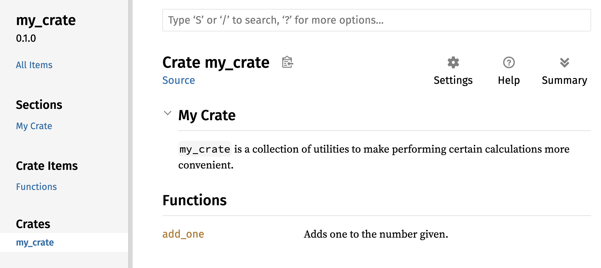

## Публикация библиотеки в Crates.io

Мы использовали пакеты из [crates.io](https://crates.io/)<comment></comment> в качестве зависимостей нашего проекта, но вы также можете поделиться своим кодом с другими людьми, опубликовав свои собственные пакеты. Реестр библиотек по адресу [crates.io](https://crates.io/)<comment></comment> распространяет исходный код ваших пакетов, поэтому он в основном размещает код с открытым исходным кодом.

В Rust и Cargo есть возможности, которые облегчают использование и поиск вашего опубликованного пакета. Далее мы поговорим о некоторых из этих возможностей, а затем объясним, как опубликовать пакет.

### Создание полезных комментариев к документации

Аккуратное документирование ваших пакетов поможет другим пользователям знать, как и когда их использовать, поэтому стоит потратить время на написание документации. В главе 3 мы обсуждали, как комментировать код Rust, используя две косые черты, `//`. В Rust также есть особый вид комментариев к документации, который обычно называется *комментарием к документации*, который генерирует документацию HTML. HTML-код отображает содержимое комментариев к документации для публичных элементов API, предназначенных для программистов, заинтересованных в знании того, как *использовать* вашу библиотеку, в отличие от того, как она *реализована*.

Комментарии к документации используют три слеша, `///` вместо двух и поддерживают нотацию Markdown для форматирования текста. Размещайте комментарии к документации непосредственно перед элементом, который они документируют. В листинге 14-1 показаны комментарии к документации для функции `add_one` в библиотеке с именем `my_crate`:

<span class="filename">Файл: src/lib.rs</span>

```rust,ignore
/// Adds one to the number given.
///
/// # Examples
///
/// ```
/// let arg = 5;
/// let answer = my_crate::add_one(arg);
///
/// assert_eq!(6, answer);
/// ```
pub fn add_one(x: i32) -> i32 {
    x + 1
}
```

<span class="caption">Листинг 14-1: Комментарий к документации для функции</span>

Здесь мы даём описание того, что делает функция `add_one`, начинаем раздел с заголовка `Examples`, а затем предоставляем код, который демонстрирует, как использовать функцию `add_one`. Мы можем сгенерировать документацию HTML из этого комментария к документации, запустив `cargo doc`. Эта команда запускает инструмент `rustdoc`, поставляемый с Rust, и помещает сгенерированную HTML-документацию в каталог *target/doc*.

Для удобства, запустив `cargo doc --open`, мы создадим HTML для документации вашей текущей библиотеки (а также документацию для всех зависимостей вашей библиотеки) и откроем результат в веб-браузере. Перейдите к функции `add_one` и вы увидите, как отображается текст в комментариях к документации, что показано на рисунке 14-1:


<span class="caption">Рисунок 14-1: HTML документация для функции <code>add_one</code></span>

#### Часто используемые разделы

Мы использовали Markdown заголовок `# Examples` в листинге 14-1 для создания раздела в HTML с заголовком "Examples". Вот некоторые другие разделы, которые авторы библиотек обычно используют в своей документации:

- **Panics**: Сценарии, в которых документированная функция может вызывать панику. Вызывающие функцию, которые не хотят, чтобы их программы паниковали, должны убедиться, что они не вызывают функцию в этих ситуациях.
- **Ошибки**: Если функция возвращает `Result`, описание типов ошибок, которые могут произойти и какие условия могут привести к тому, что эти ошибки могут быть возвращены, может быть полезным для вызывающих, так что они могут написать код для обработки различных типов ошибок разными способами.
- **Безопасность**: Если функция является `unsafe` для вызова (мы обсуждаем безопасность в главе 19), должен быть раздел, объясняющий, почему функция небезопасна и охватывающий инварианты, которые функция ожидает от вызывающих сторон.

Большинству комментариев к документации не нужны все эти разделы, но это хороший контрольный список, чтобы напомнить вам об аспектах вашего кода, о которых люди, вызывающие ваш код, будут заинтересованы узнать.

#### Комментарии к документации как тесты

Добавление примеров кода в комментарии к документации может помочь продемонстрировать, как использовать вашу библиотеку, и это даёт дополнительный бонус: запуск `cargo test` запустит примеры кода в вашей документации как тесты! Нет ничего лучше, чем документация с примерами. Но нет ничего хуже, чем примеры, которые не работают, потому что код изменился с момента написания документации. Если мы запустим `cargo test` с документацией для функции `add_one` из листинга 14-1, мы увидим раздел результатов теста, подобный этому:

```text
   Doc-tests my_crate

running 1 test
test src/lib.rs - add_one (line 5) ... ok

test result: ok. 1 passed; 0 failed; 0 ignored; 0 measured; 0 filtered out
```

Теперь, если мы изменим либо функцию, либо пример, так что `assert_eq!` в примере паникует, и снова запустим `cargo test`, мы увидим, что тесты документации обнаруживают, что пример и код не синхронизированы друг с другом!

#### Комментирование содержащихся элементов

Другой стиль комментариев к документу, `//!`, добавляет документацию к элементу, содержащему комментарии, а не добавляет документацию к элементам, следующим за комментариями. Обычно мы используем эти комментарии к документу внутри корневого файла крейта (*src/lib.rs* по соглашению) или внутри модуля для документирования крейта или модуля в целом.

Например, если мы хотим добавить документацию, описывающую назначение крейта `my_crate`, который содержит функцию `add_one`, мы можем добавить комментарии к документации, начинающиеся с `//!`, в начало *src/lib.rs*, как показано в листинге 14-2:

<span class="filename">Файл: src/lib.rs</span>

```rust,ignore
//! # My Crate
//!
//! `my_crate` is a collection of utilities to make performing certain
//! calculations more convenient.

/// Adds one to the number given.
// --snip--
```

<span class="caption">Листинг 14-2: Документация для крейта <code>my_crate</code> в целом</span>

Обратите внимание, что нет кода после последней строки, начинающейся с `//!`. Поскольку мы начинали комментарии с `//!` вместо `///`, мы документируем элемент, который содержит этот комментарий, а не элемент, следующий за этим комментарием. В этом случае элементом, содержащим этот комментарий, является файл *src/lib.rs*, который является корнем крейта. Эти комментарии описывают всю крейт.

Когда мы запускаем `cargo doc --open`, эти комментарии будут отображаться на первой странице документации для `my_crate` над списком публичных элементов в библиотеке, как показано на рисунке 14-2:



<span class="caption">Рисунок 14-2: Предоставленная документация для <code>my_crate</code>, включая комментарий, описывающие крейт в целом</span>

Комментарии к документации внутри элементов полезны для описания крейтов и модулей особенно. Используйте их, чтобы объяснить общую цель контейнера, чтобы помочь вашим пользователям понять организацию крейта.

### Экспорт публичного API с `pub use`

В главе 7 мы рассмотрели, как организовать ваш код в модули с помощью ключевого слова `mod`, как сделать элементы публичными с помощью ключевого слова `pub` и как подключить элементы в область видимости с помощью ключевого слова `use`. Однако структура, которая имеет смысл для вас при разработке крейта, может быть не очень удобной для пользователей. Возможно, вы захотите организовать свои структуры в иерархию, содержащую несколько уровней, но тогда люди, которые хотят использовать тип, определённый вами глубоко в иерархии, могут столкнуться с трудностями при обнаружении того, что этот тип существует. Они также могут быть раздражены необходимостью ввода `use` `my_crate::some_module::another_module::UsefulType;` вместо ввода `use` `my_crate::UsefulType;`.

Структура вашего публичного API является основным фактором при публикации крейта. Люди, которые используют вашу библиотеку, менее знакомы со структурой, чем вы и могут столкнуться с трудностями при поиске частей, которые они хотят использовать, если ваша библиотека имеет большую иерархию модулей.

Хорошей новостью является то, что если структура *не* удобна для использования другими из другой библиотеки, вам не нужно перестраивать внутреннюю организацию: вместо этого вы можете реэкспортировать элементы, чтобы сделать публичную структуру, отличную от вашей внутренней структуры, используя `pub use`. Реэкспорт берет открытый элемент в одном месте и делает его публичным в другом месте, как если бы он был определён в другом месте.

Например, скажем, мы создали библиотеку с именем `art` для моделирования художественных концепций. Внутри этой библиотеки есть два модуля: модуль `kinds` содержащий два перечисления с именами `PrimaryColor` и `SecondaryColor` и модуль `utils`, содержащий функцию с именем `mix`, как показано в листинге 14-3:

<span class="filename">Файл: src/lib.rs</span>

```rust
//! # Art
//!
//! A library for modeling artistic concepts.

pub mod kinds {
    /// The primary colors according to the RYB color model.
    pub enum PrimaryColor {
        Red,
        Yellow,
        Blue,
    }

    /// The secondary colors according to the RYB color model.
    pub enum SecondaryColor {
        Orange,
        Green,
        Purple,
    }
}

pub mod utils {
    use crate::kinds::*;

    /// Combines two primary colors in equal amounts to create
    /// a secondary color.
    pub fn mix(c1: PrimaryColor, c2: PrimaryColor) -> SecondaryColor {
        // --snip--
#         SecondaryColor::Orange
    }
}
# fn main() {}
```

<span class="caption">Листинг 14-3: Библиотека <code>art</code> с элементами, организованными в модули <code>kinds</code> и <code>utils</code></span>

На рисунке 14-3 показано, как будет выглядеть титульная страница документации для этого крейта, сгенерированный `cargo doc`:


<span class="caption">Рисунок 14-3: Первая страница документации для <code>art</code>, в которой перечислены модули <code>kinds</code> и <code>utils</code></span>

Обратите внимание, что типы `PrimaryColor` и `SecondaryColor` не указаны на главной странице, равно как и функция `mix`. Мы должны нажать `kinds` и `utils`, чтобы увидеть их.

В другой библиотеке, которая зависит от этой библиотеки, потребуются операторы `use`, которые подключают элементы из `art` в область видимости, определяя структуру модуля, которая определена в данный момент. В листинге 14-4 показан пример крейта, в котором используются элементы `PrimaryColor` и `mix` из крейта `art`:

<span class="filename">Файл: src/main.rs</span>

```rust,ignore
use art::kinds::PrimaryColor;
use art::utils::mix;

fn main() {
    let red = PrimaryColor::Red;
    let yellow = PrimaryColor::Yellow;
    mix(red, yellow);
}
```

<span class="caption">Листинг 14-4: Крейт использующий элементы из крейта <code>art</code> с экспортированной внутренней структурой</span>

Автор кода в листинге 14-4, в котором используется крейт `art`, должен был выяснить, что `PrimaryColor` находится в модуле `kinds`, а `mix` находится в модуле `utils`. Модульная структура крейта `art` больше уместна разработчикам работающим над крейтом `art`, чем разработчикам, использующим крейт `art`. Внутренняя структура, которая организует части библиотеки в модуль `kinds` и модуль `utils`, не содержит никакой полезной информации для того, кто пытается понять, как использовать крейт `art`. Вместо этого, структура модулей крейта `art` вызывает путаницу, потому что разработчики должны выяснить где делать поиск и структура неудобна, потому что разработчики должны указывать имена модулей в операторах `use`.

Чтобы удалить внутреннюю организацию из общедоступного API, мы можем изменить код крейта `art` в листинге 14-3, чтобы добавить операторы `pub use` для повторного реэкспорта элементов на верхнем уровне, как показано в листинге 14-5:

<span class="filename">Файл: src/lib.rs</span>

```rust,ignore
//! # Art
//!
//! A library for modeling artistic concepts.

pub use self::kinds::PrimaryColor;
pub use self::kinds::SecondaryColor;
pub use self::utils::mix;

pub mod kinds {
    // --snip--
}

pub mod utils {
    // --snip--
}
```

<span class="caption">Листинг 14-5: Добавление операторов <code>pub use</code> для реэкспорта элементов</span>

Документация API, которую `cargo doc` генерирует для этой библиотеки, теперь будет перечислять и связывать реэкспорты на главной странице, как показано на рисунке 14-4, упрощая поиск типов `PrimaryColor`, `SecondaryColor` и функции `mix`.


<span class="caption">Рисунок 14-4: Первая страница документации для <code>art</code>,  которая перечисляет реэкспорт</span>

Пользователи крейта `art` могут по-прежнему видеть и использовать внутреннюю структуру из листинга 14-3, как показано в листинге 14-4, или они могут использовать более удобную структуру в листинге 14-5, как показано в листинге 14-6:

<span class="filename">Файл: src/main.rs</span>

```rust,ignore
use art::PrimaryColor;
use art::mix;

fn main() {
    // --snip--
}
```

<span class="caption">Листинг 14-6: Программа, использующая реэкспортированные элементы из крейта <code>art</code></span>

В тех случаях, когда имеется много вложенных модулей, реэкспорт типов на верхнем уровне с помощью `pub use` может существенно изменить опыт людей, использующих библиотеку.

Создание полезной публичной структуры API - это больше искусство чем наука, и вы можете повторять, чтобы найти API, который лучше всего подойдёт вашим пользователям. Использование `pub use` дает вам гибкость в том, как вы структурируете свою библиотеку внутри и отделяете эту внутреннюю структуру от того, что вы предоставляете пользователям. Посмотрите на код некоторых установленных крейтов, чтобы увидеть отличается ли их внутренняя структура от их публичного API.

### Настройка учётной записи Crates.io

Прежде чем вы сможете опубликовать любые библиотеки, вам необходимо создать учётную запись на [crates.io](https://crates.io/)<comment></comment> и получить API токен. Для этого зайдите на домашнюю страницу [crates.io](https://crates.io/)<comment></comment> и войдите в систему через учётную запись GitHub. (В настоящее время требуется наличие учётной записи GitHub, но сайт может поддерживать другие способы создания учётной записи в будущем.) Сразу после входа в систему перейдите в настройки своей учётной записи по адресу [https://crates.io/me/](https://crates.io/me/)<comment></comment> и получите свой ключ API. Затем выполните команду `cargo login` с вашим ключом API, например:

```text
$ cargo login abcdefghijklmnopqrstuvwxyz012345
```

Эта команда сообщит Cargo о вашем API token и сохранит его локально в *~/.cargo/credentials*. Обратите внимание, что этот токен является *секретным*: не делитесь им ни с кем другим. Если вы по какой-либо причине поделитесь им с кем-либо, вы должны отозвать его и сгенерировать новый токен на [crates.io](https://crates.io/).

### Добавление метаданных в новую библиотеку

Теперь у вас есть аккаунт, допустим, у вас есть библиотека, которую вы хотите опубликовать. Перед публикацией вам необходимо добавить некоторые метаданные в ваш крейт, добавив их в раздел `[package]` файла *Cargo.toml*.

Вашему крейту понадобится уникальное имя. Пока вы работаете над библиотекой локально, вы можете назвать библиотеку как угодно. Однако имена крейтов на [crates.io](https://crates.io/)<comment></comment> выделяются по принципу "первым пришёл - первым обслужен". Как только имя крейта занято, никто не может опубликовать крейт с таким именем. Прежде чем пытаться опубликовать крейт, поищите имя, которое вы хотите использовать на сайте. Если имя было использовано другим крейтом, то вам нужно найти другое имя и отредактировать поле `name` в файле *Cargo.toml* в разделе `[package]`, чтобы использовать новое имя для публикации, например, так:

<span class="filename">Файл: Cargo.toml</span>

```toml
[package]
name = "guessing_game"
```

Даже если вы выбрали уникальное имя, когда вы запустите `cargo publish` чтобы опубликовать крейт, вы получите предупреждение, а затем ошибку:

```text
$ cargo publish
    Updating registry `https://github.com/rust-lang/crates.io-index`
warning: manifest has no description, license, license-file, documentation,
homepage or repository.
--snip--
error: api errors: missing or empty metadata fields: description, license.
```

Причина в том, что вам не хватает важной информации: требуется описание и лицензия, чтобы люди знали, что делает ваша библиотека, и на каких условиях они могут её использовать. Чтобы исправить эту ошибку, вам нужно включить эту информацию в файл *Cargo.toml*.

Добавьте описание, которое из себя представляет одно или два предложения, потому что оно будет отображаться вместе с вашим крейтом в результатах поиска. В поле `license` необходимо указать *значение идентификатора лицензии*. В [Linux Foundation’s Software Package Data Exchange (SPDX)](http://spdx.org/licenses/) перечислены идентификаторы, которые можно использовать для этого значения. Например, чтобы указать, что вы лицензировали свою библиотеку с использованием лицензии MIT, добавьте идентификатор `MIT`:

<span class="filename">Файл: Cargo.toml</span>

```toml
[package]
name = "guessing_game"
license = "MIT"
```

Если вы хотите использовать лицензию, которая отсутствует в SPDX, вам нужно поместить текст этой лицензии в файл, включите файл в свой проект, а затем используйте `license-file`, чтобы указать имя этого файла вместо использования ключа `license`.

Руководство по выбору лицензии для вашего проекта выходит за рамки этой книги. Многие люди в сообществе Rust лицензируют свои проекты так же, как и Rust, используя двойную лицензию `MIT OR Apache 2.0`. Эта практика демонстрирует, что вы также можете указать несколько идентификаторов лицензий, разделённых `OR`, чтобы иметь несколько лицензий для вашего проекта.

С уникальным именем, версией, подробностями об авторе, что `cargo new` добавил при создании крейта, вашим описанием и добавленной лицензией, файл *Cargo.toml* для проекта, который готов к публикации, может выглядеть следующим образом:

<span class="filename">Файл: Cargo.toml</span>

```toml
[package]
name = "guessing_game"
version = "0.1.0"
authors = ["Your Name <you@example.com>"]
edition = "2018"
description = "A fun game where you guess what number the computer has chosen."
license = "MIT OR Apache-2.0"

[dependencies]
```

[Документация Cargo](https://doc.rust-lang.org/cargo/) описывает другие метаданные, которые вы можете указать, чтобы другие могли легче находить и использовать ваш крейт.

### Публикация на Crates.io

Теперь, когда вы создали учётную запись, сохранили свой токен API, выбрали имя для своего крейта и указали необходимые метаданные, вы готовы к публикации! Публикация библиотеки загружает определённую версию в [crates.io](https://crates.io/)<comment></comment> для использования другими.

Будьте осторожны при публикации библиотеки, потому что публикация является *постоянной*. Версия никогда не может быть перезаписана и код не может быть удалён. Одна из основных целей [crates.io](https://crates.io/)<comment></comment> - является работа как постоянного архив кода, чтобы сборки всех проектов, которые зависят от библиотек из [crates.io](https://crates.io/)<comment> </comment>, продолжали работать. Разрешение на удаление версий сделает достижение этой цели невозможным. Однако, количество версий библиотек, которые вы можете опубликовать, не ограничено.

Запустите команду `cargo publish` еще раз. Сейчас эта команда должна выполниться успешно:

```text
$ cargo publish
 Updating registry `https://github.com/rust-lang/crates.io-index`
Packaging guessing_game v0.1.0 (file:///projects/guessing_game)
Verifying guessing_game v0.1.0 (file:///projects/guessing_game)
Compiling guessing_game v0.1.0
(file:///projects/guessing_game/target/package/guessing_game-0.1.0)
 Finished dev [unoptimized + debuginfo] target(s) in 0.19 secs
Uploading guessing_game v0.1.0 (file:///projects/guessing_game)
```

Поздравляем! Теперь вы поделились своим кодом с сообществом Rust и любой может легко добавить вашу библиотеку в качестве зависимости их проекта.

### Публикация новой версии существующей библиотеки

Когда вы внесли изменения в свой крейт и готовы выпустить новую версию, измените значение `version`, указанное в вашем файле *Cargo.toml* и повторите публикацию. Воспользуйтесь [Semantic Versioning rules](http://semver.org/), чтобы решить, какой номер следующей версии подходит для ваших изменений. Затем запустите `cargo publish`, чтобы загрузить новую версию.

### Удаление версий из Crates.io с помощью `cargo yank`

Хотя вы не можете удалить предыдущие версии крейта, вы можете помешать любым будущим проектам добавлять его в качестве новой зависимости. Это полезно, когда версия крейта сломана по той или иной причине. В таких ситуациях Cargo поддерживает *выламывание* (yanking) версии крейта.

Выламывание версии не позволяет новым проектам зависеть от этой версии, а все существующие проекты, которые зависят от неё, продолжают скачивать и зависеть от этой версии. По сути, выламывание означает, что все проекты с *Cargo.lock* не сломаются, и любые будущие сгенерированные файлы *Cargo.lock* не будут использовать выломанную версию.

Чтобы выломать версию крейт, запустите `cargo yank` и укажите, какую версию вы хотите выломать:

```text
$ cargo yank --vers 1.0.1
```

Добавив в команду `--undo`, вы также можете отменить выламывание и разрешить проектам начать зависеть от версии снова:

```text
$ cargo yank --vers 1.0.1 --undo
```

Выламывание *не* удаляет код. Например, функция выламывания не предназначена для удаления случайно загруженных секретов. Если это произойдёт, вы должны немедленно сбросить эти секреты.
