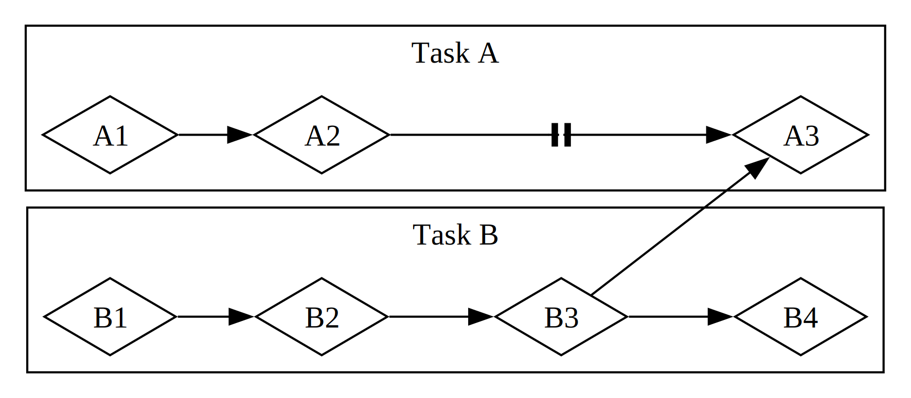

# Основы асинхронного программирования: async, await, futures и streams

Многие операции, которые мы просим компьютер выполнить, могут занимать
некоторое время. Было бы хорошо иметь возможность делать что-то еще, пока мы
ждем завершения этих длительных процессов. Современные компьютеры предлагают
две техники для работы более чем над одной операцией одновременно: параллелизм
и конкурентность. Однако логика наших программ в основном записывается
линейно. Мы хотели бы иметь возможность указывать операции, которые должна
выполнить программа, и точки, в которых функция могла бы приостановиться, а
другая часть программы вместо нее могла бы выполняться, без необходимости
заранее точно указывать порядок и способ выполнения каждого фрагмента кода.
_Асинхронное программирование_ -- это абстракция, которая позволяет выражать
код в терминах потенциальных точек приостановки и будущих результатов, беря на
себя детали координации.

Эта глава опирается на использование потоков для параллелизма и конкурентности
из главы 16 и вводит альтернативный подход к написанию кода: Rust futures,
streams, а также синтаксис `async` и `await`, позволяющие выражать, как
операции могут быть асинхронными, и сторонние крейты, реализующие асинхронные
среды выполнения: код, который управляет выполнением асинхронных операций и
координирует его.

Рассмотрим пример. Допустим, вы экспортируете созданное вами видео семейного
праздника, и эта операция может занять от нескольких минут до нескольких
часов. Экспорт видео будет использовать столько мощности CPU и GPU, сколько
сможет. Если бы у вас было только одно ядро CPU и ваша операционная система не
приостанавливала бы экспорт до его завершения, то есть выполняла бы экспорт
_синхронно_, вы не могли бы делать на компьютере ничего другого, пока эта
задача выполняется. Это было бы довольно неприятно. К счастью, операционная
система вашего компьютера может и действительно незаметно прерывает экспорт
достаточно часто, чтобы вы могли одновременно выполнять другую работу.

Теперь предположим, что вы скачиваете видео, которым поделился кто-то другой.
Это тоже может занять некоторое время, но не требует так много времени CPU. В
этом случае CPU должен ждать, пока данные поступят из сети. Хотя вы можете
начать читать данные, как только они начнут поступать, может потребоваться
некоторое время, пока появятся все данные. Даже когда все данные уже есть,
если видео довольно большое, его загрузка целиком может занять как минимум
секунду или две. Это может звучать не так уж много, но для современного
процессора, который может выполнять миллиарды операций в секунду, это очень
долго. И снова ваша операционная система незаметно прервет программу, чтобы
позволить CPU выполнять другую работу, пока он ждет завершения сетевого
вызова.

Экспорт видео -- пример операции, _ограниченной CPU_ или _ограниченной
вычислениями_. Она ограничена потенциальной скоростью обработки данных
компьютером внутри CPU или GPU и тем, какую часть этой скорости он может
выделить операции. Скачивание видео -- пример операции, _ограниченной I/O_,
потому что она ограничена скоростью _ввода и вывода_ компьютера; она может
выполняться только настолько быстро, насколько данные могут передаваться по
сети.

В обоих этих примерах невидимые прерывания операционной системы предоставляют
форму конкурентности. Однако эта конкурентность происходит только на уровне
всей программы: операционная система прерывает одну программу, чтобы позволить
другим программам выполнить работу. Во многих случаях, поскольку мы понимаем
свои программы на гораздо более детальном уровне, чем операционная система, мы
можем заметить возможности для конкурентности, которые операционная система не
видит.

Например, если мы создаем инструмент для управления скачиванием файлов, мы
должны иметь возможность написать программу так, чтобы начало одного
скачивания не блокировало пользовательский интерфейс, а пользователи могли
запускать несколько скачиваний одновременно. Однако многие API операционных
систем для взаимодействия с сетью являются _блокирующими_: то есть они
блокируют продвижение программы, пока обрабатываемые ими данные не будут
полностью готовы.

> Примечание: если подумать, именно так работает _большинство_ вызовов
> функций. Однако термин _блокирующий_ обычно зарезервирован для вызовов
> функций, которые взаимодействуют с файлами, сетью или другими ресурсами
> компьютера, потому что именно в этих случаях отдельной программе была бы
> полезна неблокирующая операция.

Мы могли бы избежать блокировки основного потока, создав отдельный поток для
скачивания каждого файла. Однако накладные расходы системных ресурсов,
используемых этими потоками, в конце концов стали бы проблемой. Было бы лучше,
если бы вызов вообще не блокировал выполнение, а вместо этого мы могли бы
определить набор задач, которые хотим, чтобы программа выполнила, и позволить
среде выполнения выбрать лучший порядок и способ их выполнения.

Именно это дает нам абстракция Rust _async_ (сокращение от _asynchronous_,
асинхронный). В этой главе вы узнаете все об async, пока мы будем рассматривать
следующие темы:

- Как использовать синтаксис Rust `async` и `await` и выполнять асинхронные
  функции с помощью среды выполнения
- Как использовать асинхронную модель для решения некоторых из тех же задач,
  которые мы рассматривали в главе 16
- Как многопоточность и async предоставляют взаимодополняющие решения, которые
  во многих случаях можно сочетать

Однако прежде чем увидеть, как async работает на практике, нужно сделать
небольшое отступление и обсудить различия между параллелизмом и
конкурентностью.

## Параллелизм и конкурентность

До сих пор мы рассматривали параллелизм и конкурентность как в основном
взаимозаменяемые понятия. Теперь нужно различить их точнее, потому что эти
различия проявятся, когда мы начнем работать.

Рассмотрим разные способы, которыми команда могла бы разделить работу над
программным проектом. Вы могли бы назначить одному участнику несколько задач,
назначить каждому участнику по одной задаче или использовать смесь двух
подходов.

Когда один человек работает над несколькими разными задачами до того, как
какая-либо из них завершена, это _конкурентность_. Один способ реализовать
конкурентность похож на ситуацию, когда на вашем компьютере открыты два разных
проекта, и когда вам становится скучно или вы застреваете в одном проекте, вы
переключаетесь на другой. Вы всего один человек, поэтому не можете продвигаться
по обеим задачам точно в одно и то же время, но можете работать в
многозадачном режиме, продвигаясь по одной задаче за раз, переключаясь между
ними (см. рисунок 17-1).

<figure>

<figcaption>Рисунок 17-1: конкурентный рабочий процесс с переключением между Task A и Task B</figcaption>

</figure>

Когда команда разделяет группу задач так, что каждый участник берет одну
задачу и работает над ней отдельно, это _параллелизм_. Каждый человек в
команде может продвигаться точно в одно и то же время (см. рисунок 17-2).

<figure>

<figcaption>Рисунок 17-2: параллельный рабочий процесс, где работа над Task A и Task B выполняется независимо</figcaption>

</figure>

В обоих этих рабочих процессах вам, возможно, придется координировать разные
задачи. Может быть, вы думали, что задача, назначенная одному человеку,
полностью независима от работы всех остальных, но на самом деле она требует,
чтобы другой человек в команде сначала завершил свою задачу. Некоторая часть
работы могла выполняться параллельно, но часть на самом деле была
_последовательной_: она могла происходить только последовательно, одна задача
за другой, как на рисунке 17-3.

<figure>

<figcaption>Рисунок 17-3: частично параллельный рабочий процесс, где работа над Task A и Task B выполняется независимо, пока Task A3 не блокируется на результатах Task B3.</figcaption>

</figure>

Точно так же вы можете понять, что одна из ваших собственных задач зависит от
другой вашей задачи. Теперь ваша конкурентная работа тоже стала
последовательной.

Параллелизм и конкурентность также могут пересекаться. Если вы узнаете, что
коллега застрял, пока вы не завершите одну из своих задач, вы, вероятно,
сосредоточите все усилия на этой задаче, чтобы “разблокировать” коллегу. Вы и
ваш коллега больше не можете работать параллельно, и вы также больше не можете
конкурентно работать над собственными задачами.

Та же базовая динамика проявляется в программном обеспечении и оборудовании.
На машине с одним ядром CPU процессор может выполнять только одну операцию за
раз, но все равно может работать конкурентно. Используя инструменты вроде
потоков, процессов и async, компьютер может приостановить одну активность и
переключиться на другие, прежде чем в конечном счете снова вернуться к первой
активности. На машине с несколькими ядрами CPU он также может выполнять работу
параллельно. Одно ядро может выполнять одну задачу, пока другое ядро выполняет
совершенно не связанную с ней задачу, и эти операции действительно происходят
в одно и то же время.

Выполнение async-кода в Rust обычно происходит конкурентно. В зависимости от
оборудования, операционной системы и используемой нами async-среды выполнения
(подробнее об async-средах выполнения скоро), эта конкурентность под капотом
может также использовать параллелизм.

Теперь погрузимся в то, как на самом деле работает асинхронное
программирование в Rust.
