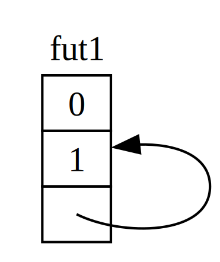
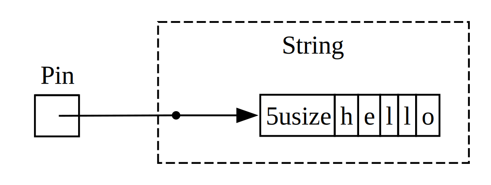

<!-- Old headings. Do not remove or links may break. -->

<a id="digging-into-the-traits-for-async"></a>

## Более пристальный взгляд на трейты для async

На протяжении главы мы по-разному использовали трейты `Future`, `Stream` и
`StreamExt`. Однако до сих пор мы избегали слишком глубокого погружения в
детали того, как они работают или как связаны друг с другом, и большую часть
времени для повседневной работы с Rust этого достаточно. Но иногда вы будете
сталкиваться с ситуациями, где нужно понимать немного больше подробностей об
этих трейтах, а также о типе `Pin` и трейте `Unpin`. В этом разделе мы
разберемся ровно настолько, чтобы помочь в таких сценариях, оставив
_действительно_ глубокое погружение другой документации.

<!-- Old headings. Do not remove or links may break. -->

<a id="future"></a>

### Трейт `Future`

Начнем с более пристального взгляда на то, как работает трейт `Future`. Вот
как Rust определяет его:

```rust
use std::pin::Pin;
use std::task::{Context, Poll};

pub trait Future {
    type Output;

    fn poll(self: Pin<&mut Self>, cx: &mut Context<'_>) -> Poll<Self::Output>;
}
```

Это определение трейта включает множество новых типов, а также некоторый
синтаксис, которого мы раньше не видели, поэтому разберем определение по
частям.

Во-первых, связанный тип `Output` у `Future` говорит, какое значение future
выдаст после завершения. Это аналогично связанному типу `Item` у трейта
`Iterator`. Во-вторых, у `Future` есть метод `poll`, который принимает
специальную ссылку, обернутую в `Pin`, для своего параметра `self` и изменяемую
ссылку на тип `Context`, а возвращает `Poll<Self::Output>`. Мы поговорим
подробнее о `Pin` и `Context` через мгновение. Пока сосредоточимся на том, что
возвращает этот метод, то есть на типе `Poll`:

```rust
pub enum Poll<T> {
    Ready(T),
    Pending,
}
```

Этот тип `Poll` похож на `Option`. У него есть один вариант со значением,
`Ready(T)`, и один без значения, `Pending`. Однако `Poll` означает нечто
совсем иное, чем `Option`! Вариант `Pending` указывает, что future еще должен
выполнить работу, поэтому вызывающей стороне нужно будет проверить его позже
еще раз. Вариант `Ready` указывает, что `Future` завершил свою работу и
значение `T` доступно.

> Примечание: Обычно нет необходимости вызывать `poll` напрямую, но если вам
> все же нужно это сделать, помните, что для большинства futures вызывающая
> сторона не должна снова вызывать `poll` после того, как future вернул
> `Ready`. Многие futures вызовут панику, если их снова опросить после
> готовности. Futures, которые безопасно опрашивать повторно, явно сообщат об
> этом в своей документации. Это похоже на поведение `Iterator::next`.

Когда вы видите код, использующий `await`, Rust под капотом компилирует его в
код, который вызывает `poll`. Если вернуться к листингу 17-4, где мы печатали
заголовок страницы для одного URL после того, как он разрешился, Rust
компилирует это во что-то примерно (хотя и не точно) похожее на следующее:

```rust,ignore
match page_title(url).poll() {
    Ready(page_title) => match page_title {
        Some(title) => println!("The title for {url} was {title}"),
        None => println!("{url} had no title"),
    }
    Pending => {
        // But what goes here?
    }
}
```

Что нам делать, когда future все еще находится в состоянии `Pending`? Нам
нужен какой-то способ пробовать снова, и снова, и снова, пока future наконец не
станет готовым. Другими словами, нам нужен цикл:

```rust,ignore
let mut page_title_fut = page_title(url);
loop {
    match page_title_fut.poll() {
        Ready(value) => match page_title {
            Some(title) => println!("The title for {url} was {title}"),
            None => println!("{url} had no title"),
        }
        Pending => {
            // continue
        }
    }
}
```

Однако если бы Rust компилировал это именно в такой код, каждый `await` был бы
блокирующим — то есть давал бы ровно противоположное тому, к чему мы стремимся!
Вместо этого Rust гарантирует, что цикл может передать управление чему-то, что
способно приостановить работу над этим future, поработать над другими futures,
а затем снова проверить этот future позже. Как мы уже видели, это «что-то» —
async-среда выполнения, и эта работа по планированию и координации является
одной из ее основных задач.

В разделе [«Передача данных между двумя задачами с помощью передачи
сообщений»][message-passing]<!-- ignore --> мы описывали ожидание `rx.recv`.
Вызов `recv` возвращает future, а ожидание future опрашивает его. Мы отметили,
что среда выполнения приостановит future, пока он не будет готов либо с
`Some(message)`, либо с `None`, когда канал закроется. С нашим более глубоким
пониманием трейта `Future`, и особенно `Future::poll`, мы можем увидеть, как
это работает. Среда выполнения знает, что future не готов, когда он возвращает
`Poll::Pending`. И наоборот, среда выполнения знает, что future _готов_, и
продвигает его, когда `poll` возвращает `Poll::Ready(Some(message))` или
`Poll::Ready(None)`.

Точные подробности того, как среда выполнения это делает, выходят за рамки
этой книги, но важно увидеть базовую механику futures: среда выполнения
_опрашивает_ каждый future, за который она отвечает, снова усыпляя future,
когда он еще не готов.

<!-- Old headings. Do not remove or links may break. -->

<a id="pinning-and-the-pin-and-unpin-traits"></a>
<a id="the-pin-and-unpin-traits"></a>

### Тип `Pin` и трейт `Unpin`

В листинге 17-13 мы использовали макрос `trpl::join!`, чтобы ожидать три
futures. Однако часто бывает коллекция, например вектор, содержащая некоторое
количество futures, которое будет известно только во время выполнения. Давайте
изменим листинг 17-13 на код из листинга 17-23, который помещает три futures в
вектор и вместо этого вызывает функцию `trpl::join_all`; этот код пока не
скомпилируется.

<Listing number="17-23" caption="Ожидание futures в коллекции"  file-name="src/main.rs">

```rust,ignore,does_not_compile
{{#rustdoc_include ../listings/ch17-async-await/listing-17-23/src/main.rs:here}}
```

</Listing>

Мы помещаем каждый future внутрь `Box`, чтобы превратить их в _трейт-объекты_,
точно так же, как делали в разделе «Возврат ошибок из `run`» главы 12. (Мы
подробно рассмотрим трейт-объекты в главе 18.) Использование трейт-объектов
позволяет нам обращаться с каждым из анонимных futures, создаваемых этими
типами, как с одним и тем же типом, потому что все они реализуют трейт
`Future`.

Это может удивить. В конце концов, ни один из async-блоков ничего не
возвращает, поэтому каждый из них создает `Future<Output = ()>`. Однако
помните, что `Future` — это трейт, и компилятор создает уникальное
перечисление для каждого async-блока, даже если у них одинаковые типы вывода.
Точно так же, как нельзя положить две разные вручную написанные структуры в
`Vec`, нельзя смешивать перечисления, сгенерированные компилятором.

Затем мы передаем коллекцию futures в функцию `trpl::join_all` и ожидаем
результат. Однако это не компилируется; вот соответствующая часть сообщений об
ошибках.

<!-- manual-regeneration
cd listings/ch17-async-await/listing-17-23
cargo build
copy *only* the final `error` block from the errors
-->

```text
error[E0277]: `dyn Future<Output = ()>` cannot be unpinned
  --> src/main.rs:48:33
   |
48 |         trpl::join_all(futures).await;
   |                                 ^^^^^ the trait `Unpin` is not implemented for `dyn Future<Output = ()>`
   |
   = note: consider using the `pin!` macro
           consider using `Box::pin` if you need to access the pinned value outside of the current scope
   = note: required for `Box<dyn Future<Output = ()>>` to implement `Future`
note: required by a bound in `futures_util::future::join_all::JoinAll`
  --> file:///home/.cargo/registry/src/index.crates.io-1949cf8c6b5b557f/futures-util-0.3.30/src/future/join_all.rs:29:8
   |
27 | pub struct JoinAll<F>
   |            ------- required by a bound in this struct
28 | where
29 |     F: Future,
   |        ^^^^^^ required by this bound in `JoinAll`
```

Примечание в этом сообщении об ошибке говорит нам, что следует использовать
макрос `pin!`, чтобы _закрепить_ значения; это означает поместить их внутрь
типа `Pin`, который гарантирует, что значения не будут перемещены в памяти.
Сообщение об ошибке говорит, что закрепление требуется, потому что
`dyn Future<Output = ()>` должен реализовывать трейт `Unpin`, а сейчас он его
не реализует.

Функция `trpl::join_all` возвращает структуру с именем `JoinAll`. Эта структура
обобщена по типу `F`, который ограничен требованием реализовывать трейт
`Future`. Прямое ожидание future с помощью `await` закрепляет future неявно.
Именно поэтому нам не нужно использовать `pin!` везде, где мы хотим ожидать
futures.

Однако здесь мы не ожидаем future напрямую. Вместо этого мы конструируем новый
future, `JoinAll`, передавая коллекцию futures в функцию `join_all`. Сигнатура
`join_all` требует, чтобы все типы элементов в коллекции реализовывали трейт
`Future`, а `Box<T>` реализует `Future` только если оборачиваемый им `T`
является future, который реализует трейт `Unpin`.

Это много информации! Чтобы действительно понять это, давайте немного глубже
погрузимся в то, как на самом деле работает трейт `Future`, особенно вокруг
закрепления. Снова взгляните на определение трейта `Future`:

```rust
use std::pin::Pin;
use std::task::{Context, Poll};

pub trait Future {
    type Output;

    // Required method
    fn poll(self: Pin<&mut Self>, cx: &mut Context<'_>) -> Poll<Self::Output>;
}
```

Параметр `cx` и его тип `Context` являются ключом к тому, как среда выполнения
на самом деле узнает, когда проверять конкретный future и при этом оставаться
ленивой. Опять же, подробности того, как это работает, выходят за рамки этой
главы, и обычно вам нужно думать об этом только при написании собственной
реализации `Future`. Вместо этого мы сосредоточимся на типе для `self`,
поскольку это первый раз, когда мы видим метод, где у `self` есть аннотация
типа. Аннотация типа для `self` работает как аннотации типов для других
параметров функции, но с двумя ключевыми отличиями:

- Она сообщает Rust, какого типа должен быть `self`, чтобы метод можно было
  вызвать.
- Это не может быть просто любой тип. Он ограничен типом, для которого
  реализован метод, ссылкой или умным указателем на этот тип, либо `Pin`,
  оборачивающим ссылку на этот тип.

Подробнее этот синтаксис мы увидим в [главе 18][ch-18]<!-- ignore -->. Пока
достаточно знать, что если мы хотим опросить future, чтобы проверить, находится
ли он в состоянии `Pending` или `Ready(Output)`, нам нужна обернутая в `Pin`
изменяемая ссылка на тип.

`Pin` — это обертка для указателеподобных типов, таких как `&`, `&mut`, `Box`
и `Rc`. (Технически `Pin` работает с типами, которые реализуют трейты `Deref`
или `DerefMut`, но фактически это эквивалентно работе только со ссылками и
умными указателями.) `Pin` сам по себе не является указателем и не имеет
собственного поведения, как `Rc` и `Arc` с подсчетом ссылок; это всего лишь
инструмент, который компилятор может использовать для соблюдения ограничений
на использование указателей.

Вспоминая, что `await` реализован через вызовы `poll`, мы начинаем понимать
сообщение об ошибке, которое видели ранее, но там речь шла об `Unpin`, а не о
`Pin`. Так как именно `Pin` связан с `Unpin`, и почему `Future` требует, чтобы
`self` находился в типе `Pin` для вызова `poll`?

Помните из начала этой главы, что серия точек await в future компилируется в
конечный автомат, а компилятор гарантирует, что этот конечный автомат следует
всем обычным правилам безопасности Rust, включая заимствование и владение.
Чтобы это работало, Rust смотрит, какие данные нужны между одной точкой await
и либо следующей точкой await, либо концом async-блока. Затем он создает
соответствующий вариант в скомпилированном конечном автомате. Каждый вариант
получает нужный ему доступ к данным, которые будут использоваться в этом
участке исходного кода: либо принимая владение этими данными, либо получая
изменяемую или неизменяемую ссылку на них.

Пока все хорошо: если мы ошибемся с владением или ссылками в заданном
async-блоке, проверщик заимствований сообщит нам об этом. Но когда мы хотим
перемещать future, соответствующий этому блоку, например переместить его в
`Vec`, чтобы передать в `join_all`, все становится сложнее.

Когда мы перемещаем future — будь то помещая его в структуру данных, чтобы
использовать как итератор с `join_all`, или возвращая его из функции, — это на
самом деле означает перемещение конечного автомата, который Rust создает для
нас. И в отличие от большинства других типов в Rust, futures, которые Rust
создает для async-блоков, могут в итоге иметь ссылки на самих себя в полях
любого конкретного варианта, как показано в упрощенной иллюстрации на рисунке
17-4.

<figure>



<figcaption>Рисунок 17-4: Самоссылочный тип данных</figcaption>

</figure>

По умолчанию любой объект, имеющий ссылку на самого себя, небезопасно
перемещать, потому что ссылки всегда указывают на фактический адрес памяти
того, на что они ссылаются (см. рисунок 17-5). Если вы переместите саму
структуру данных, эти внутренние ссылки останутся указывать на старое место.
Однако это место памяти теперь недействительно. С одной стороны, его значение
не будет обновляться, когда вы будете вносить изменения в структуру данных. С
другой, что важнее, компьютер теперь свободен использовать эту память для
других целей! Позже вы можете в итоге прочитать совершенно не связанные с этим
данные.

<figure>


<figcaption>Рисунок 17-5: Небезопасный результат перемещения самоссылочного типа данных</figcaption>

</figure>

Теоретически компилятор Rust мог бы пытаться обновлять каждую ссылку на объект
каждый раз, когда он перемещается, но это могло бы добавить большие накладные
расходы производительности, особенно если нужно обновлять целую сеть ссылок.
Если бы вместо этого мы могли гарантировать, что рассматриваемая структура
данных _не перемещается в памяти_, нам не пришлось бы обновлять никакие ссылки.
Именно для этого и нужен проверщик заимствований Rust: в безопасном коде он не
позволяет перемещать любой элемент, на который есть активная ссылка.

`Pin` строится на этом и дает нам именно ту гарантию, которая нужна. Когда мы
_закрепляем_ значение, оборачивая указатель на это значение в `Pin`, оно больше
не может перемещаться. Таким образом, если у вас есть `Pin<Box<SomeType>>`, вы
на самом деле закрепляете значение `SomeType`, _а не_ указатель `Box`. Рисунок
17-6 иллюстрирует этот процесс.

<figure>


<figcaption>Рисунок 17-6: Закрепление `Box`, указывающего на самоссылочный тип future</figcaption>

</figure>

На самом деле указатель `Box` по-прежнему может свободно перемещаться.
Помните: нам важно убедиться, что данные, на которые в конечном счете есть
ссылка, остаются на месте. Если указатель перемещается, _но данные, на которые
он указывает_, остаются на том же месте, как на рисунке 17-7, потенциальной
проблемы нет. (В качестве самостоятельного упражнения посмотрите документацию
для типов, а также модуль `std::pin`, и попробуйте понять, как сделать это с
`Pin`, оборачивающим `Box`.) Ключевой момент в том, что сам самоссылочный тип
не может перемещаться, потому что он все еще закреплен.

<figure>


<figcaption>Рисунок 17-7: Перемещение `Box`, который указывает на самоссылочный тип future</figcaption>

</figure>

Однако большинство типов совершенно безопасно перемещать, даже если они
оказались за указателем `Pin`. Нам нужно думать о закреплении только тогда,
когда у элементов есть внутренние ссылки. Примитивные значения, такие как
числа и логические значения, безопасны, потому что у них очевидно нет
внутренних ссылок. У большинства типов, с которыми вы обычно работаете в Rust,
их тоже нет. Например, `Vec` можно перемещать без опасений. Учитывая то, что
мы уже увидели, если у вас есть `Pin<Vec<String>>`, вам пришлось бы делать все
через безопасные, но ограничительные API, предоставляемые `Pin`, хотя
`Vec<String>` всегда безопасно перемещать, если на него нет других ссылок. Нам
нужен способ сказать компилятору, что в таких случаях элементы можно
перемещать, и именно здесь вступает в дело `Unpin`.

`Unpin` — это маркерный трейт, похожий на трейты `Send` и `Sync`, которые мы
видели в главе 16, и потому он не имеет собственной функциональности.
Маркерные трейты существуют только для того, чтобы сообщать компилятору, что
безопасно использовать тип, реализующий данный трейт, в определенном
контексте. `Unpin` сообщает компилятору, что данный тип _не_ должен
поддерживать никаких гарантий о том, можно ли безопасно перемещать
соответствующее значение.

<!--
  The inline `<code>` in the next block is to allow the inline `<em>` inside it,
  matching what NoStarch does style-wise, and emphasizing within the text here
  that it is something distinct from a normal type.
-->

Как и в случае с `Send` и `Sync`, компилятор автоматически реализует `Unpin`
для всех типов, для которых он может доказать безопасность этого. Особый
случай, опять же похожий на `Send` и `Sync`, — когда `Unpin` _не_ реализован
для типа. Обозначение для этого выглядит как <code>impl !Unpin for
<em>SomeType</em></code>, где <code><em>SomeType</em></code> — имя типа,
который _должен_ поддерживать эти гарантии, чтобы быть безопасным всякий раз,
когда указатель на этот тип используется в `Pin`.

Другими словами, о связи между `Pin` и `Unpin` нужно помнить две вещи.
Во-первых, `Unpin` — это «нормальный» случай, а `!Unpin` — особый случай.
Во-вторых, реализует ли тип `Unpin` или `!Unpin`, имеет значение _только_
тогда, когда вы используете закрепленный указатель на этот тип, например
<code>Pin<&mut <em>SomeType</em>></code>.

Чтобы сделать это конкретным, подумайте о `String`: у него есть длина и
символы Unicode, из которых он состоит. Мы можем обернуть `String` в `Pin`, как
показано на рисунке 17-8. Однако `String` автоматически реализует `Unpin`, как
и большинство других типов в Rust.

<figure>



<figcaption>Рисунок 17-8: Закрепление `String`; пунктирная линия показывает, что `String` реализует трейт `Unpin` и поэтому не закреплен</figcaption>

</figure>

В результате мы можем делать вещи, которые были бы незаконны, если бы `String`
вместо этого реализовывал `!Unpin`, например заменить одну строку другой точно
в том же месте памяти, как на рисунке 17-9. Это не нарушает контракт `Pin`,
потому что у `String` нет внутренних ссылок, из-за которых его было бы
небезопасно перемещать. Именно поэтому он реализует `Unpin`, а не `!Unpin`.

<figure>


<figcaption>Рисунок 17-9: Замена `String` совершенно другим `String` в памяти</figcaption>

</figure>

Теперь мы знаем достаточно, чтобы понять ошибки, сообщенные для вызова
`join_all` из листинга 17-23. Изначально мы пытались переместить futures,
созданные async-блоками, в `Vec<Box<dyn Future<Output = ()>>>`, но, как мы
увидели, у этих futures могут быть внутренние ссылки, поэтому они автоматически
не реализуют `Unpin`. Когда мы закрепим их, мы сможем передать получившийся
тип `Pin` в `Vec`, будучи уверенными, что лежащие в основе данные в futures
_не_ будут перемещены. Листинг 17-24 показывает, как исправить код, вызвав
макрос `pin!` там, где определен каждый из трех futures, и скорректировав тип
трейт-объекта.

<Listing number="17-24" caption="Закрепление futures, чтобы разрешить их перемещение в вектор">

```rust
{{#rustdoc_include ../listings/ch17-async-await/listing-17-24/src/main.rs:here}}
```

</Listing>

Теперь этот пример компилируется и выполняется, и мы могли бы добавлять futures
в вектор или удалять их из него во время выполнения и ожидать их все вместе.

`Pin` и `Unpin` в основном важны для создания низкоуровневых библиотек или при
создании самой среды выполнения, а не для повседневного Rust-кода. Но когда вы
видите эти трейты в сообщениях об ошибках, теперь вы будете лучше понимать,
как исправить свой код!

> Примечание: Эта комбинация `Pin` и `Unpin` позволяет безопасно реализовать в
> Rust целый класс сложных типов, которые иначе оказались бы затруднительными,
> потому что они самоссылочные. Типы, требующие `Pin`, сегодня чаще всего
> встречаются в async Rust, но время от времени вы можете увидеть их и в других
> контекстах.
>
> Подробности того, как работают `Pin` и `Unpin`, и правила, которые они должны
> соблюдать, подробно описаны в API-документации для `std::pin`, поэтому если
> вы хотите узнать больше, это отличное место для начала.
>
> Если вы хотите еще подробнее понять, как все работает под капотом, см. главы
> [2][under-the-hood]<!-- ignore --> и [4][pinning]<!-- ignore --> книги
> [_Asynchronous Programming in Rust_][async-book].

### Трейт `Stream`

Теперь, когда у вас есть более глубокое понимание трейтов `Future`, `Pin` и
`Unpin`, мы можем обратить внимание на трейт `Stream`. Как вы узнали ранее в
главе, streams похожи на асинхронные итераторы. Однако, в отличие от
`Iterator` и `Future`, на момент написания этой книги `Stream` не имеет
определения в стандартной библиотеке, но существует очень распространенное
определение из крейта `futures`, используемое по всей экосистеме.

Давайте повторим определения трейтов `Iterator` и `Future`, прежде чем
посмотрим, как трейт `Stream` может объединить их. Из `Iterator` у нас есть
идея последовательности: его метод `next` предоставляет `Option<Self::Item>`.
Из `Future` у нас есть идея готовности во времени: его метод `poll`
предоставляет `Poll<Self::Output>`. Чтобы представить последовательность
элементов, которые становятся готовыми со временем, мы определяем трейт
`Stream`, объединяющий эти особенности:

```rust
use std::pin::Pin;
use std::task::{Context, Poll};

trait Stream {
    type Item;

    fn poll_next(
        self: Pin<&mut Self>,
        cx: &mut Context<'_>
    ) -> Poll<Option<Self::Item>>;
}
```

Трейт `Stream` определяет связанный тип с именем `Item` для типа элементов,
производимых stream. Это похоже на `Iterator`, где элементов может быть от
нуля до многих, и отличается от `Future`, где всегда есть один `Output`, даже
если это единичный тип `()`.

`Stream` также определяет метод для получения этих элементов. Мы называем его
`poll_next`, чтобы было ясно, что он опрашивает так же, как это делает
`Future::poll`, и производит последовательность элементов так же, как это
делает `Iterator::next`. Его возвращаемый тип объединяет `Poll` с `Option`.
Внешний тип — `Poll`, потому что его нужно проверять на готовность, как и
future. Внутренний тип — `Option`, потому что он должен сигнализировать, есть
ли еще элементы, как это делает итератор.

Что-то очень похожее на это определение, вероятно, в итоге станет частью
стандартной библиотеки Rust. Тем временем оно является частью инструментария
большинства сред выполнения, так что вы можете на него полагаться, и все, что
мы рассмотрим дальше, в целом должно применяться!

Однако в примерах, которые мы видели в разделе [«Streams: futures в
последовательности»][streams]<!-- ignore -->, мы использовали не `poll_next` и
не `Stream`, а `next` и `StreamExt`. Конечно, мы _могли бы_ работать напрямую
с API `poll_next`, вручную написав свои собственные конечные автоматы
`Stream`, точно так же как мы _могли бы_ работать с futures напрямую через их
метод `poll`. Но использовать `await` намного удобнее, и трейт `StreamExt`
предоставляет метод `next`, чтобы мы могли делать именно это:

```rust
{{#rustdoc_include ../listings/ch17-async-await/no-listing-stream-ext/src/lib.rs:here}}
```

<!--
TODO: update this if/when tokio/etc. update their MSRV and switch to using async functions
in traits, since the lack thereof is the reason they do not yet have this.
-->

> Примечание: Фактическое определение, которое мы использовали ранее в главе,
> выглядит немного иначе, потому что оно поддерживает версии Rust, которые еще
> не поддерживали использование async-функций в трейтах. В результате оно
> выглядит так:
>
> ```rust,ignore
> fn next(&mut self) -> Next<'_, Self> where Self: Unpin;
> ```
>
> Этот тип `Next` является `struct`, реализующей `Future`, и позволяет нам
> назвать время жизни ссылки на `self` с помощью `Next<'_, Self>`, чтобы
> `await` мог работать с этим методом.

Трейт `StreamExt` также является местом для всех интересных методов, доступных
для использования со streams. `StreamExt` автоматически реализуется для каждого
типа, который реализует `Stream`, но эти трейты определены отдельно, чтобы
сообщество могло развивать удобные API без влияния на фундаментальный трейт.

В версии `StreamExt`, используемой в крейте `trpl`, трейт не только определяет
метод `next`, но и предоставляет реализацию `next` по умолчанию, которая
корректно обрабатывает детали вызова `Stream::poll_next`. Это означает, что
даже когда вам нужно написать собственный потоковый тип данных, вам _нужно
только_ реализовать `Stream`, а затем любой, кто использует ваш тип данных,
сможет автоматически использовать с ним `StreamExt` и его методы.

Это все, что мы собираемся рассмотреть о низкоуровневых деталях этих трейтов.
В завершение давайте подумаем, как futures (включая streams), задачи и потоки
соотносятся друг с другом!

[message-passing]: ch17-02-concurrency-with-async.md#sending-data-between-two-tasks-using-message-passing
[ch-18]: ch18-00-oop.html
[async-book]: https://rust-lang.github.io/async-book/
[under-the-hood]: https://rust-lang.github.io/async-book/02_execution/01_chapter.html
[pinning]: https://rust-lang.github.io/async-book/04_pinning/01_chapter.html
[first-async]: ch17-01-futures-and-syntax.html#our-first-async-program
[any-number-futures]: ch17-03-more-futures.html#working-with-any-number-of-futures
[streams]: ch17-04-streams.html
